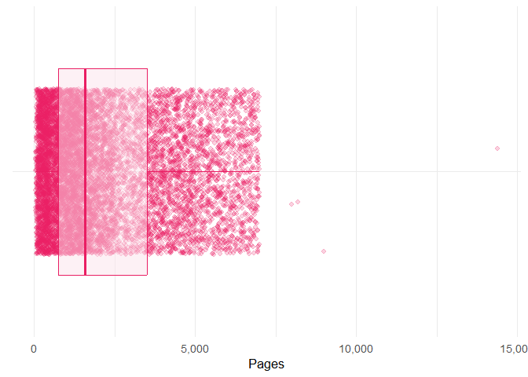
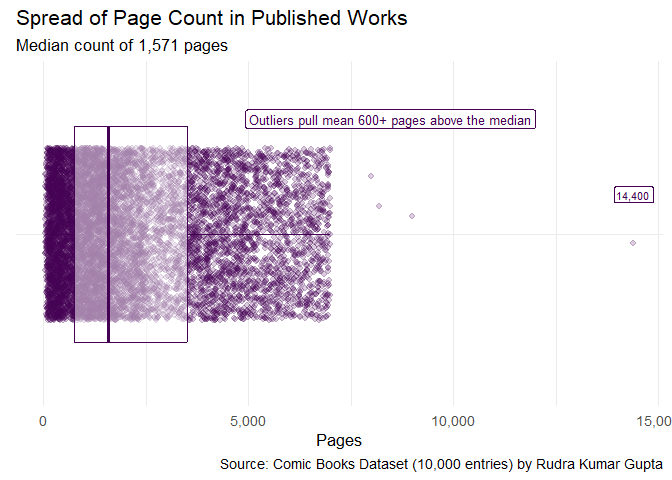
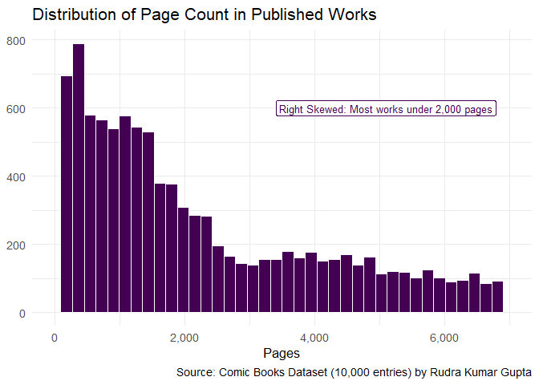
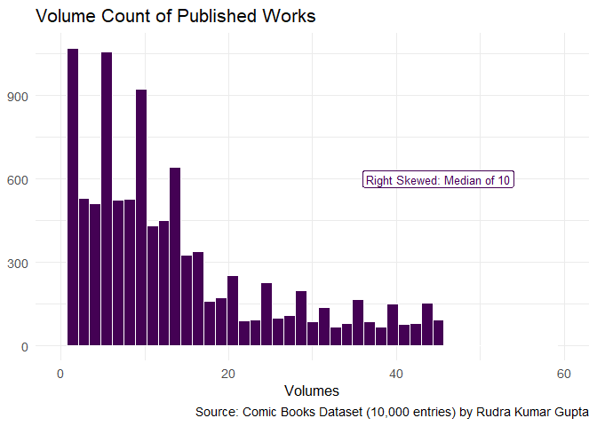
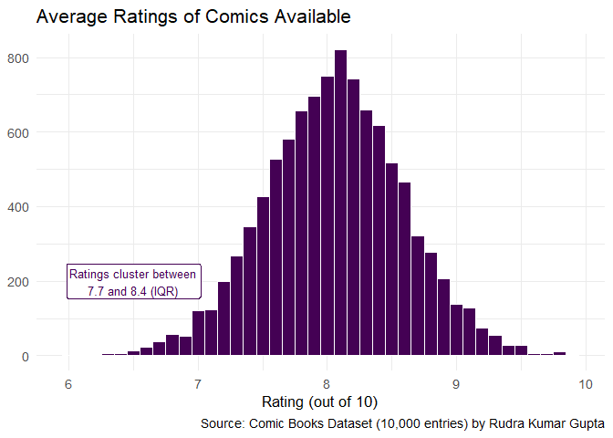
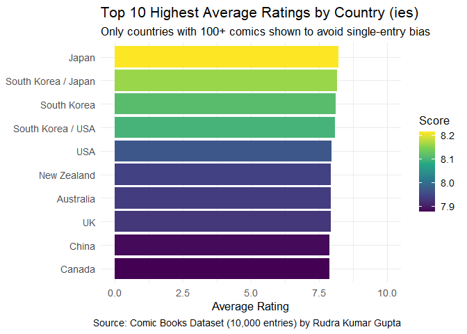
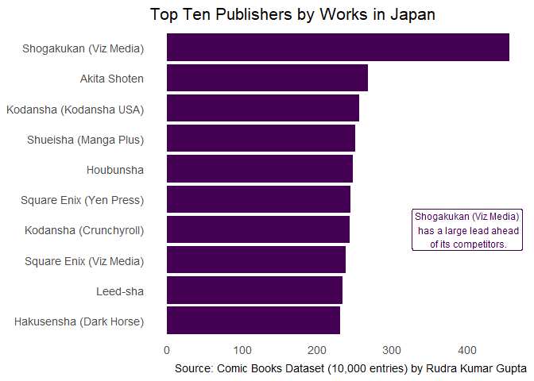
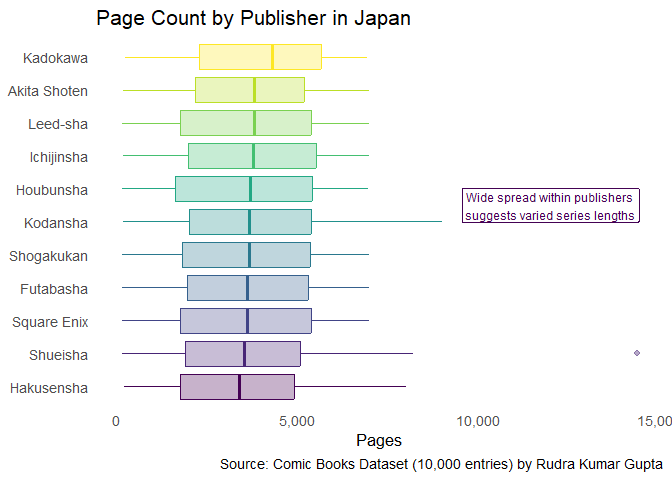

# Pre-requisites

``` r
library(tidyverse)
library(dplyr)
library(gt)
library(plotly)
set.seed(636)
```

``` r
url <- "https://raw.githubusercontent.com/mela636/dataviz_final_project/main/data/comic_books_10000_dataset.csv"
comics <- read.csv(url)
```

``` r
head(comics)
```

    ##    comic_id              Title          Writer         Artist
    ## 1 CMC-00001      Tiger of Zero  Gintoki Sakata Gintoki Sakata
    ## 2 CMC-00002       Twisted Claw  Fumi Takahashi    Mika Sasaki
    ## 3 CMC-00003 Jean Grey: Rebirth    Chip Zdarsky         Bendis
    ## 4 CMC-00004      Abyss Destiny  Yuna Yamaguchi Yuna Yamaguchi
    ## 5 CMC-00005        After Smoke Shannon Watters   Warren Ellis
    ## 6 CMC-00006       Ghost Memory  Ryota Nakamura  Ryu Hashimoto
    ##          Studio.Publisher Release.Year        Format
    ## 1  Shogakukan (Viz Media)         2001      Tankobon
    ## 2  Shogakukan (Viz Media)         2015      Tankobon
    ## 3           Marvel Comics         2016 Graphic Novel
    ## 4 Kodansha (Kodansha USA)         2014  Manga Volume
    ## 5         Kodansha Comics         2005           OGN
    ## 6   Shueisha (Manga Plus)         2015  Manga Volume
    ##            Theme..Color.Style.                 Genre Country.of.Origin
    ## 1 Full Color (Special Edition)      Shoujo / Romance             Japan
    ## 2                Black & White   Action / Historical             Japan
    ## 3                   Full Color  Superhero / Thriller               USA
    ## 4                Black & White Slice of Life / Drama             Japan
    ## 5                Black & White       Romance / Drama               USA
    ## 6                Black & White      Action / Fantasy             Japan
    ##   Page.Count Rating..out.of.10.    Status Language Age.Rating
    ## 1        890                8.0   Ongoing Japanese     Mature
    ## 2       2850                8.3 Completed Japanese     Mature
    ## 3        350                7.8   Ongoing  English      Teen+
    ## 4        592                8.7 Cancelled Japanese      Teen+
    ## 5       2465                7.0   Ongoing  English     Mature
    ## 6        774                8.8 Completed Japanese   All Ages
    ##                          Awards Volume.Count
    ## 1                          None           13
    ## 2                          None           12
    ## 3 Japan Media Arts Award Winner           13
    ## 4          Eisner Award Nominee           13
    ## 5                          None            4
    ## 6          Harvey Award Nominee           34

``` r
glimpse(comics)
```

    ## Rows: 10,000
    ## Columns: 17
    ## $ comic_id            <chr> "CMC-00001", "CMC-00002", "CMC-00003", "CMC-00004"…
    ## $ Title               <chr> "Tiger of Zero", "Twisted Claw", "Jean Grey: Rebir…
    ## $ Writer              <chr> "Gintoki Sakata", "Fumi Takahashi", "Chip Zdarsky"…
    ## $ Artist              <chr> "Gintoki Sakata", "Mika Sasaki", "Bendis", "Yuna Y…
    ## $ Studio.Publisher    <chr> "Shogakukan (Viz Media)", "Shogakukan (Viz Media)"…
    ## $ Release.Year        <int> 2001, 2015, 2016, 2014, 2005, 2015, 2017, 2012, 20…
    ## $ Format              <chr> "Tankobon", "Tankobon", "Graphic Novel", "Manga Vo…
    ## $ Theme..Color.Style. <chr> "Full Color (Special Edition)", "Black & White", "…
    ## $ Genre               <chr> "Shoujo / Romance", "Action / Historical", "Superh…
    ## $ Country.of.Origin   <chr> "Japan", "Japan", "USA", "Japan", "USA", "Japan", …
    ## $ Page.Count          <int> 890, 2850, 350, 592, 2465, 774, 4186, 6498, 1455, …
    ## $ Rating..out.of.10.  <dbl> 8.0, 8.3, 7.8, 8.7, 7.0, 8.8, 8.0, 8.2, 8.5, 8.0, …
    ## $ Status              <chr> "Ongoing", "Completed", "Ongoing", "Cancelled", "O…
    ## $ Language            <chr> "Japanese", "Japanese", "English", "Japanese", "En…
    ## $ Age.Rating          <chr> "Mature", "Mature", "Teen+", "Teen+", "Mature", "A…
    ## $ Awards              <chr> "None", "None", "Japan Media Arts Award Winner", "…
    ## $ Volume.Count        <int> 13, 12, 13, 13, 4, 34, 43, 12, 19, 39, 2, 45, 3, 2…

------------------------------------------------------------------------

# Introduction

The purpose of this report is to explore the **“Comic Books Dataset
(10,000 entries)”** dataset provided by *Rudra Kumar Gupta* from Kaggle.
It is composed of 17 features and 10,000 observations. Certain features
include the title of the comic, writer, artist (as there are situations
where they are seperate from the writer), year released, genre, etc.
that encompasses each comic. I wish to explore the the distribution of
page counts and ratings, publishing trends over time, and how country of
origin and publisher relate to the volume and reception of works within
the dataset.

------------------------------------------------------------------------

# Data Cleaning & Wrangling

To make the features more clean, they are renamed to be all lowercase
and use “\_” rather than periods. Additionally, create a new variable
called “awarded” and “decade” in order to explore if a published work
received any type of award, as well as classify that which decade the
work was published in rather than by year. <br>

``` r
comics <- comics %>%
  rename(
    comic_id = comic_id,
    title = Title,
    writer = Writer,
    artist = Artist,
    publisher = Studio.Publisher,
    year = Release.Year,
    format = Format,
    color_style = Theme..Color.Style.,
    genre = Genre,
    country = Country.of.Origin,
    pages = Page.Count,
    rating = Rating..out.of.10.,
    status = Status,
    language = Language,
    age_rating = Age.Rating,
    awards = Awards,
    volumes = Volume.Count
  )
```

**awarded**: Binary variable that marks if an award has been given.<br>
**decade**: Numerical variable that states which decade a work was
published.

``` r
comics <- comics %>%
  mutate(
    awarded = awards != "None",
    decade = paste0(floor(year / 10) * 10, "s"))
```

<br> In order to make sure there are no missing values, the purpose of
this chunk was to view if there were any observations with values not
available. Of which, it demonstrates there are none. <br>

``` r
comics %>%
  summarise(across(everything(), ~ sum(is.na(.)))) %>%
  pivot_longer(everything(), names_to = "column", values_to = "n_missing") %>%
  filter(n_missing > 0)
```

    ## # A tibble: 0 × 2
    ## # ℹ 2 variables: column <chr>, n_missing <int>

------------------------------------------------------------------------

# Summary Statistcs

For the pages available, there is a minimum of 48 pages- being the
shortest published work. On the other hand, there is a maximum of 14,400
pages being the longest published work. There is a large range with a
clear outlier that is impacting the mean (2,232 pages) being over 600
pages more than the median. The lowest rating recorded is a score of 6
with the highest being 9.9. As for volumes, there is a minimum of 1.
There is no completion status variable, however it would be interesting
to see the volume count of completed works. In my personal experience,
many romance manga I read are one-shots: a standalone comic that tells a
complete story. As for other genres of manga, such as shounen, are
longer series. It would be nice to possibly explore a relationship
between volumes of completed works and genres. <br>

``` r
summary(comics[c("pages", "rating", "volumes")])
```

    ##      pages             rating         volumes     
    ##  Min.   :   48.0   Min.   :6.000   Min.   : 1.00  
    ##  1st Qu.:  748.8   1st Qu.:7.700   1st Qu.: 5.00  
    ##  Median : 1571.0   Median :8.100   Median :10.00  
    ##  Mean   : 2232.9   Mean   :8.057   Mean   :13.67  
    ##  3rd Qu.: 3511.0   3rd Qu.:8.400   3rd Qu.:19.00  
    ##  Max.   :14400.0   Max.   :9.900   Max.   :56.00

<p>
When breaking down how many comics are available by country within this
dataset, the highest is Japan with 3,575 followed by the United States
with 3,150 total. There is a steep decline as the highest count is below
1,000 with only 897 comics in South Korea. It’s important to note that
there are combinations of countries as, for example, certain comics
originate from both South Korea and Japan.
</p>

``` r
comics %>%
  count(country, sort = TRUE) %>% 
  slice_head(n = 5) %>% 
  gt() %>% 
  tab_header(title = "Number of Comics by Country") %>% 
  cols_label(country = "Country", n = "Count") %>% 
  fmt_number(columns = n, decimals = 0, use_seps = TRUE) %>% 
  data_color(
    columns = n,
    palette = "viridis") %>% 
  tab_options(
    table.font.size = px(14),
    heading.title.font.size = px(18),
    column_labels.font.weight = "bold")
```

<div id="khwcezysbr" style="padding-left:0px;padding-right:0px;padding-top:10px;padding-bottom:10px;overflow-x:auto;overflow-y:auto;width:auto;height:auto;">
<style>#khwcezysbr table {
  font-family: system-ui, 'Segoe UI', Roboto, Helvetica, Arial, sans-serif, 'Apple Color Emoji', 'Segoe UI Emoji', 'Segoe UI Symbol', 'Noto Color Emoji';
  -webkit-font-smoothing: antialiased;
  -moz-osx-font-smoothing: grayscale;
}
&#10;#khwcezysbr thead, #khwcezysbr tbody, #khwcezysbr tfoot, #khwcezysbr tr, #khwcezysbr td, #khwcezysbr th {
  border-style: none;
}
&#10;#khwcezysbr p {
  margin: 0;
  padding: 0;
}
&#10;#khwcezysbr .gt_table {
  display: table;
  border-collapse: collapse;
  line-height: normal;
  margin-left: auto;
  margin-right: auto;
  color: #333333;
  font-size: 14px;
  font-weight: normal;
  font-style: normal;
  background-color: #FFFFFF;
  width: auto;
  border-top-style: solid;
  border-top-width: 2px;
  border-top-color: #A8A8A8;
  border-right-style: none;
  border-right-width: 2px;
  border-right-color: #D3D3D3;
  border-bottom-style: solid;
  border-bottom-width: 2px;
  border-bottom-color: #A8A8A8;
  border-left-style: none;
  border-left-width: 2px;
  border-left-color: #D3D3D3;
}
&#10;#khwcezysbr .gt_caption {
  padding-top: 4px;
  padding-bottom: 4px;
}
&#10;#khwcezysbr .gt_title {
  color: #333333;
  font-size: 18px;
  font-weight: initial;
  padding-top: 4px;
  padding-bottom: 4px;
  padding-left: 5px;
  padding-right: 5px;
  border-bottom-color: #FFFFFF;
  border-bottom-width: 0;
}
&#10;#khwcezysbr .gt_subtitle {
  color: #333333;
  font-size: 85%;
  font-weight: initial;
  padding-top: 3px;
  padding-bottom: 5px;
  padding-left: 5px;
  padding-right: 5px;
  border-top-color: #FFFFFF;
  border-top-width: 0;
}
&#10;#khwcezysbr .gt_heading {
  background-color: #FFFFFF;
  text-align: center;
  border-bottom-color: #FFFFFF;
  border-left-style: none;
  border-left-width: 1px;
  border-left-color: #D3D3D3;
  border-right-style: none;
  border-right-width: 1px;
  border-right-color: #D3D3D3;
}
&#10;#khwcezysbr .gt_bottom_border {
  border-bottom-style: solid;
  border-bottom-width: 2px;
  border-bottom-color: #D3D3D3;
}
&#10;#khwcezysbr .gt_col_headings {
  border-top-style: solid;
  border-top-width: 2px;
  border-top-color: #D3D3D3;
  border-bottom-style: solid;
  border-bottom-width: 2px;
  border-bottom-color: #D3D3D3;
  border-left-style: none;
  border-left-width: 1px;
  border-left-color: #D3D3D3;
  border-right-style: none;
  border-right-width: 1px;
  border-right-color: #D3D3D3;
}
&#10;#khwcezysbr .gt_col_heading {
  color: #333333;
  background-color: #FFFFFF;
  font-size: 100%;
  font-weight: bold;
  text-transform: inherit;
  border-left-style: none;
  border-left-width: 1px;
  border-left-color: #D3D3D3;
  border-right-style: none;
  border-right-width: 1px;
  border-right-color: #D3D3D3;
  vertical-align: bottom;
  padding-top: 5px;
  padding-bottom: 6px;
  padding-left: 5px;
  padding-right: 5px;
  overflow-x: hidden;
}
&#10;#khwcezysbr .gt_column_spanner_outer {
  color: #333333;
  background-color: #FFFFFF;
  font-size: 100%;
  font-weight: bold;
  text-transform: inherit;
  padding-top: 0;
  padding-bottom: 0;
  padding-left: 4px;
  padding-right: 4px;
}
&#10;#khwcezysbr .gt_column_spanner_outer:first-child {
  padding-left: 0;
}
&#10;#khwcezysbr .gt_column_spanner_outer:last-child {
  padding-right: 0;
}
&#10;#khwcezysbr .gt_column_spanner {
  border-bottom-style: solid;
  border-bottom-width: 2px;
  border-bottom-color: #D3D3D3;
  vertical-align: bottom;
  padding-top: 5px;
  padding-bottom: 5px;
  overflow-x: hidden;
  display: inline-block;
  width: 100%;
}
&#10;#khwcezysbr .gt_spanner_row {
  border-bottom-style: hidden;
}
&#10;#khwcezysbr .gt_group_heading {
  padding-top: 8px;
  padding-bottom: 8px;
  padding-left: 5px;
  padding-right: 5px;
  color: #333333;
  background-color: #FFFFFF;
  font-size: 100%;
  font-weight: initial;
  text-transform: inherit;
  border-top-style: solid;
  border-top-width: 2px;
  border-top-color: #D3D3D3;
  border-bottom-style: solid;
  border-bottom-width: 2px;
  border-bottom-color: #D3D3D3;
  border-left-style: none;
  border-left-width: 1px;
  border-left-color: #D3D3D3;
  border-right-style: none;
  border-right-width: 1px;
  border-right-color: #D3D3D3;
  vertical-align: middle;
  text-align: left;
}
&#10;#khwcezysbr .gt_empty_group_heading {
  padding: 0.5px;
  color: #333333;
  background-color: #FFFFFF;
  font-size: 100%;
  font-weight: initial;
  border-top-style: solid;
  border-top-width: 2px;
  border-top-color: #D3D3D3;
  border-bottom-style: solid;
  border-bottom-width: 2px;
  border-bottom-color: #D3D3D3;
  vertical-align: middle;
}
&#10;#khwcezysbr .gt_from_md > :first-child {
  margin-top: 0;
}
&#10;#khwcezysbr .gt_from_md > :last-child {
  margin-bottom: 0;
}
&#10;#khwcezysbr .gt_row {
  padding-top: 8px;
  padding-bottom: 8px;
  padding-left: 5px;
  padding-right: 5px;
  margin: 10px;
  border-top-style: solid;
  border-top-width: 1px;
  border-top-color: #D3D3D3;
  border-left-style: none;
  border-left-width: 1px;
  border-left-color: #D3D3D3;
  border-right-style: none;
  border-right-width: 1px;
  border-right-color: #D3D3D3;
  vertical-align: middle;
  overflow-x: hidden;
}
&#10;#khwcezysbr .gt_stub {
  color: #333333;
  background-color: #FFFFFF;
  font-size: 100%;
  font-weight: initial;
  text-transform: inherit;
  border-right-style: solid;
  border-right-width: 2px;
  border-right-color: #D3D3D3;
  padding-left: 5px;
  padding-right: 5px;
}
&#10;#khwcezysbr .gt_stub_row_group {
  color: #333333;
  background-color: #FFFFFF;
  font-size: 100%;
  font-weight: initial;
  text-transform: inherit;
  border-right-style: solid;
  border-right-width: 2px;
  border-right-color: #D3D3D3;
  padding-left: 5px;
  padding-right: 5px;
  vertical-align: top;
}
&#10;#khwcezysbr .gt_row_group_first td {
  border-top-width: 2px;
}
&#10;#khwcezysbr .gt_row_group_first th {
  border-top-width: 2px;
}
&#10;#khwcezysbr .gt_summary_row {
  color: #333333;
  background-color: #FFFFFF;
  text-transform: inherit;
  padding-top: 8px;
  padding-bottom: 8px;
  padding-left: 5px;
  padding-right: 5px;
}
&#10;#khwcezysbr .gt_first_summary_row {
  border-top-style: solid;
  border-top-color: #D3D3D3;
}
&#10;#khwcezysbr .gt_first_summary_row.thick {
  border-top-width: 2px;
}
&#10;#khwcezysbr .gt_last_summary_row {
  padding-top: 8px;
  padding-bottom: 8px;
  padding-left: 5px;
  padding-right: 5px;
  border-bottom-style: solid;
  border-bottom-width: 2px;
  border-bottom-color: #D3D3D3;
}
&#10;#khwcezysbr .gt_grand_summary_row {
  color: #333333;
  background-color: #FFFFFF;
  text-transform: inherit;
  padding-top: 8px;
  padding-bottom: 8px;
  padding-left: 5px;
  padding-right: 5px;
}
&#10;#khwcezysbr .gt_first_grand_summary_row {
  padding-top: 8px;
  padding-bottom: 8px;
  padding-left: 5px;
  padding-right: 5px;
  border-top-style: double;
  border-top-width: 6px;
  border-top-color: #D3D3D3;
}
&#10;#khwcezysbr .gt_last_grand_summary_row_top {
  padding-top: 8px;
  padding-bottom: 8px;
  padding-left: 5px;
  padding-right: 5px;
  border-bottom-style: double;
  border-bottom-width: 6px;
  border-bottom-color: #D3D3D3;
}
&#10;#khwcezysbr .gt_striped {
  background-color: rgba(128, 128, 128, 0.05);
}
&#10;#khwcezysbr .gt_table_body {
  border-top-style: solid;
  border-top-width: 2px;
  border-top-color: #D3D3D3;
  border-bottom-style: solid;
  border-bottom-width: 2px;
  border-bottom-color: #D3D3D3;
}
&#10;#khwcezysbr .gt_footnotes {
  color: #333333;
  background-color: #FFFFFF;
  border-bottom-style: none;
  border-bottom-width: 2px;
  border-bottom-color: #D3D3D3;
  border-left-style: none;
  border-left-width: 2px;
  border-left-color: #D3D3D3;
  border-right-style: none;
  border-right-width: 2px;
  border-right-color: #D3D3D3;
}
&#10;#khwcezysbr .gt_footnote {
  margin: 0px;
  font-size: 90%;
  padding-top: 4px;
  padding-bottom: 4px;
  padding-left: 5px;
  padding-right: 5px;
}
&#10;#khwcezysbr .gt_sourcenotes {
  color: #333333;
  background-color: #FFFFFF;
  border-bottom-style: none;
  border-bottom-width: 2px;
  border-bottom-color: #D3D3D3;
  border-left-style: none;
  border-left-width: 2px;
  border-left-color: #D3D3D3;
  border-right-style: none;
  border-right-width: 2px;
  border-right-color: #D3D3D3;
}
&#10;#khwcezysbr .gt_sourcenote {
  font-size: 90%;
  padding-top: 4px;
  padding-bottom: 4px;
  padding-left: 5px;
  padding-right: 5px;
}
&#10;#khwcezysbr .gt_left {
  text-align: left;
}
&#10;#khwcezysbr .gt_center {
  text-align: center;
}
&#10;#khwcezysbr .gt_right {
  text-align: right;
  font-variant-numeric: tabular-nums;
}
&#10;#khwcezysbr .gt_font_normal {
  font-weight: normal;
}
&#10;#khwcezysbr .gt_font_bold {
  font-weight: bold;
}
&#10;#khwcezysbr .gt_font_italic {
  font-style: italic;
}
&#10;#khwcezysbr .gt_super {
  font-size: 65%;
}
&#10;#khwcezysbr .gt_footnote_marks {
  font-size: 75%;
  vertical-align: 0.4em;
  position: initial;
}
&#10;#khwcezysbr .gt_asterisk {
  font-size: 100%;
  vertical-align: 0;
}
&#10;#khwcezysbr .gt_indent_1 {
  text-indent: 5px;
}
&#10;#khwcezysbr .gt_indent_2 {
  text-indent: 10px;
}
&#10;#khwcezysbr .gt_indent_3 {
  text-indent: 15px;
}
&#10;#khwcezysbr .gt_indent_4 {
  text-indent: 20px;
}
&#10;#khwcezysbr .gt_indent_5 {
  text-indent: 25px;
}
&#10;#khwcezysbr .katex-display {
  display: inline-flex !important;
  margin-bottom: 0.75em !important;
}
&#10;#khwcezysbr div.Reactable > div.rt-table > div.rt-thead > div.rt-tr.rt-tr-group-header > div.rt-th-group:after {
  height: 0px !important;
}
</style>
<table class="gt_table" data-quarto-disable-processing="false" data-quarto-bootstrap="false">
  <thead>
    <tr class="gt_heading">
      <td colspan="2" class="gt_heading gt_title gt_font_normal gt_bottom_border" style>Number of Comics by Country</td>
    </tr>
    &#10;    <tr class="gt_col_headings">
      <th class="gt_col_heading gt_columns_bottom_border gt_left" rowspan="1" colspan="1" scope="col" id="country">Country</th>
      <th class="gt_col_heading gt_columns_bottom_border gt_right" rowspan="1" colspan="1" scope="col" id="n">Count</th>
    </tr>
  </thead>
  <tbody class="gt_table_body">
    <tr><td headers="country" class="gt_row gt_left">Japan</td>
<td headers="n" class="gt_row gt_right" style="background-color: #FDE725; color: #000000;">3,575</td></tr>
    <tr><td headers="country" class="gt_row gt_left">USA</td>
<td headers="n" class="gt_row gt_right" style="background-color: #A8DB34; color: #000000;">3,150</td></tr>
    <tr><td headers="country" class="gt_row gt_left">South Korea</td>
<td headers="n" class="gt_row gt_right" style="background-color: #424186; color: #FFFFFF;">897</td></tr>
    <tr><td headers="country" class="gt_row gt_left">China</td>
<td headers="n" class="gt_row gt_right" style="background-color: #482071; color: #FFFFFF;">550</td></tr>
    <tr><td headers="country" class="gt_row gt_left">UK</td>
<td headers="n" class="gt_row gt_right" style="background-color: #440154; color: #FFFFFF;">266</td></tr>
  </tbody>
  &#10;  
</table>
</div>

Breaking down the unique values of country, there are combinations of
countries.

``` r
unique(comics$country)
```

    ##  [1] "Japan"               "USA"                 "South Korea"        
    ##  [4] "New Zealand"         "China"               "South Korea / Japan"
    ##  [7] "Australia"           "Germany"             "Canada"             
    ## [10] "Italy"               "Belgium"             "UK"                 
    ## [13] "South Korea / USA"   "Switzerland"         "Netherlands"        
    ## [16] "Spain"               "France / Belgium"    "France"             
    ## [19] "Sweden"              "France / Iran"       "France / Spain"

<p>
When breaking down the ratings by country, rather than creating a fair
assessment, France/Iran and France/Spain dominate as there is only one
available comic in said combination of countries, which coincidentally,
have high ratings. It’s unfair to compare to Japan, which the average
rating of comics is 8.21 but is composed of 3,575 ratings in comparison
to the one.
</p>

``` r
comics %>%
  group_by(country) %>%
  summarise(
    n = n(),
    avg_rating = round(mean(rating), 2),
    pct_awarded = round(mean(awarded) * 100, 1)
  ) %>%
  arrange(desc(avg_rating)) %>% 
  slice_head(n = 5) %>% 
  gt() %>%
  tab_header(title = "Average Ratings of Comics by Country") %>%
  cols_label(
    country = "Country",
    n = "Count",
    avg_rating = md("Average<br>Rating"),
    pct_awarded = md("Percent of<br>Works Awarded")
  ) %>%
  fmt_integer(columns = n, use_seps = TRUE) %>%
  fmt_number(columns = avg_rating, decimals = 2) %>%
  fmt_number(columns = pct_awarded, decimals = 1) %>%
  data_color(
    columns = avg_rating,
    palette = "viridis") %>%
  cols_width(
  country ~ px(160),
  n ~ px(80),
  avg_rating ~ px(110),
  pct_awarded ~ px(130)) %>% 
  tab_options(
    table.font.size = px(14),
    heading.title.font.size = px(18),
    column_labels.font.weight = "bold") 
```

<div id="wydbxlhkjk" style="padding-left:0px;padding-right:0px;padding-top:10px;padding-bottom:10px;overflow-x:auto;overflow-y:auto;width:auto;height:auto;">
<style>#wydbxlhkjk table {
  font-family: system-ui, 'Segoe UI', Roboto, Helvetica, Arial, sans-serif, 'Apple Color Emoji', 'Segoe UI Emoji', 'Segoe UI Symbol', 'Noto Color Emoji';
  -webkit-font-smoothing: antialiased;
  -moz-osx-font-smoothing: grayscale;
}
&#10;#wydbxlhkjk thead, #wydbxlhkjk tbody, #wydbxlhkjk tfoot, #wydbxlhkjk tr, #wydbxlhkjk td, #wydbxlhkjk th {
  border-style: none;
}
&#10;#wydbxlhkjk p {
  margin: 0;
  padding: 0;
}
&#10;#wydbxlhkjk .gt_table {
  display: table;
  border-collapse: collapse;
  line-height: normal;
  margin-left: auto;
  margin-right: auto;
  color: #333333;
  font-size: 14px;
  font-weight: normal;
  font-style: normal;
  background-color: #FFFFFF;
  width: auto;
  border-top-style: solid;
  border-top-width: 2px;
  border-top-color: #A8A8A8;
  border-right-style: none;
  border-right-width: 2px;
  border-right-color: #D3D3D3;
  border-bottom-style: solid;
  border-bottom-width: 2px;
  border-bottom-color: #A8A8A8;
  border-left-style: none;
  border-left-width: 2px;
  border-left-color: #D3D3D3;
}
&#10;#wydbxlhkjk .gt_caption {
  padding-top: 4px;
  padding-bottom: 4px;
}
&#10;#wydbxlhkjk .gt_title {
  color: #333333;
  font-size: 18px;
  font-weight: initial;
  padding-top: 4px;
  padding-bottom: 4px;
  padding-left: 5px;
  padding-right: 5px;
  border-bottom-color: #FFFFFF;
  border-bottom-width: 0;
}
&#10;#wydbxlhkjk .gt_subtitle {
  color: #333333;
  font-size: 85%;
  font-weight: initial;
  padding-top: 3px;
  padding-bottom: 5px;
  padding-left: 5px;
  padding-right: 5px;
  border-top-color: #FFFFFF;
  border-top-width: 0;
}
&#10;#wydbxlhkjk .gt_heading {
  background-color: #FFFFFF;
  text-align: center;
  border-bottom-color: #FFFFFF;
  border-left-style: none;
  border-left-width: 1px;
  border-left-color: #D3D3D3;
  border-right-style: none;
  border-right-width: 1px;
  border-right-color: #D3D3D3;
}
&#10;#wydbxlhkjk .gt_bottom_border {
  border-bottom-style: solid;
  border-bottom-width: 2px;
  border-bottom-color: #D3D3D3;
}
&#10;#wydbxlhkjk .gt_col_headings {
  border-top-style: solid;
  border-top-width: 2px;
  border-top-color: #D3D3D3;
  border-bottom-style: solid;
  border-bottom-width: 2px;
  border-bottom-color: #D3D3D3;
  border-left-style: none;
  border-left-width: 1px;
  border-left-color: #D3D3D3;
  border-right-style: none;
  border-right-width: 1px;
  border-right-color: #D3D3D3;
}
&#10;#wydbxlhkjk .gt_col_heading {
  color: #333333;
  background-color: #FFFFFF;
  font-size: 100%;
  font-weight: bold;
  text-transform: inherit;
  border-left-style: none;
  border-left-width: 1px;
  border-left-color: #D3D3D3;
  border-right-style: none;
  border-right-width: 1px;
  border-right-color: #D3D3D3;
  vertical-align: bottom;
  padding-top: 5px;
  padding-bottom: 6px;
  padding-left: 5px;
  padding-right: 5px;
  overflow-x: hidden;
}
&#10;#wydbxlhkjk .gt_column_spanner_outer {
  color: #333333;
  background-color: #FFFFFF;
  font-size: 100%;
  font-weight: bold;
  text-transform: inherit;
  padding-top: 0;
  padding-bottom: 0;
  padding-left: 4px;
  padding-right: 4px;
}
&#10;#wydbxlhkjk .gt_column_spanner_outer:first-child {
  padding-left: 0;
}
&#10;#wydbxlhkjk .gt_column_spanner_outer:last-child {
  padding-right: 0;
}
&#10;#wydbxlhkjk .gt_column_spanner {
  border-bottom-style: solid;
  border-bottom-width: 2px;
  border-bottom-color: #D3D3D3;
  vertical-align: bottom;
  padding-top: 5px;
  padding-bottom: 5px;
  overflow-x: hidden;
  display: inline-block;
  width: 100%;
}
&#10;#wydbxlhkjk .gt_spanner_row {
  border-bottom-style: hidden;
}
&#10;#wydbxlhkjk .gt_group_heading {
  padding-top: 8px;
  padding-bottom: 8px;
  padding-left: 5px;
  padding-right: 5px;
  color: #333333;
  background-color: #FFFFFF;
  font-size: 100%;
  font-weight: initial;
  text-transform: inherit;
  border-top-style: solid;
  border-top-width: 2px;
  border-top-color: #D3D3D3;
  border-bottom-style: solid;
  border-bottom-width: 2px;
  border-bottom-color: #D3D3D3;
  border-left-style: none;
  border-left-width: 1px;
  border-left-color: #D3D3D3;
  border-right-style: none;
  border-right-width: 1px;
  border-right-color: #D3D3D3;
  vertical-align: middle;
  text-align: left;
}
&#10;#wydbxlhkjk .gt_empty_group_heading {
  padding: 0.5px;
  color: #333333;
  background-color: #FFFFFF;
  font-size: 100%;
  font-weight: initial;
  border-top-style: solid;
  border-top-width: 2px;
  border-top-color: #D3D3D3;
  border-bottom-style: solid;
  border-bottom-width: 2px;
  border-bottom-color: #D3D3D3;
  vertical-align: middle;
}
&#10;#wydbxlhkjk .gt_from_md > :first-child {
  margin-top: 0;
}
&#10;#wydbxlhkjk .gt_from_md > :last-child {
  margin-bottom: 0;
}
&#10;#wydbxlhkjk .gt_row {
  padding-top: 8px;
  padding-bottom: 8px;
  padding-left: 5px;
  padding-right: 5px;
  margin: 10px;
  border-top-style: solid;
  border-top-width: 1px;
  border-top-color: #D3D3D3;
  border-left-style: none;
  border-left-width: 1px;
  border-left-color: #D3D3D3;
  border-right-style: none;
  border-right-width: 1px;
  border-right-color: #D3D3D3;
  vertical-align: middle;
  overflow-x: hidden;
}
&#10;#wydbxlhkjk .gt_stub {
  color: #333333;
  background-color: #FFFFFF;
  font-size: 100%;
  font-weight: initial;
  text-transform: inherit;
  border-right-style: solid;
  border-right-width: 2px;
  border-right-color: #D3D3D3;
  padding-left: 5px;
  padding-right: 5px;
}
&#10;#wydbxlhkjk .gt_stub_row_group {
  color: #333333;
  background-color: #FFFFFF;
  font-size: 100%;
  font-weight: initial;
  text-transform: inherit;
  border-right-style: solid;
  border-right-width: 2px;
  border-right-color: #D3D3D3;
  padding-left: 5px;
  padding-right: 5px;
  vertical-align: top;
}
&#10;#wydbxlhkjk .gt_row_group_first td {
  border-top-width: 2px;
}
&#10;#wydbxlhkjk .gt_row_group_first th {
  border-top-width: 2px;
}
&#10;#wydbxlhkjk .gt_summary_row {
  color: #333333;
  background-color: #FFFFFF;
  text-transform: inherit;
  padding-top: 8px;
  padding-bottom: 8px;
  padding-left: 5px;
  padding-right: 5px;
}
&#10;#wydbxlhkjk .gt_first_summary_row {
  border-top-style: solid;
  border-top-color: #D3D3D3;
}
&#10;#wydbxlhkjk .gt_first_summary_row.thick {
  border-top-width: 2px;
}
&#10;#wydbxlhkjk .gt_last_summary_row {
  padding-top: 8px;
  padding-bottom: 8px;
  padding-left: 5px;
  padding-right: 5px;
  border-bottom-style: solid;
  border-bottom-width: 2px;
  border-bottom-color: #D3D3D3;
}
&#10;#wydbxlhkjk .gt_grand_summary_row {
  color: #333333;
  background-color: #FFFFFF;
  text-transform: inherit;
  padding-top: 8px;
  padding-bottom: 8px;
  padding-left: 5px;
  padding-right: 5px;
}
&#10;#wydbxlhkjk .gt_first_grand_summary_row {
  padding-top: 8px;
  padding-bottom: 8px;
  padding-left: 5px;
  padding-right: 5px;
  border-top-style: double;
  border-top-width: 6px;
  border-top-color: #D3D3D3;
}
&#10;#wydbxlhkjk .gt_last_grand_summary_row_top {
  padding-top: 8px;
  padding-bottom: 8px;
  padding-left: 5px;
  padding-right: 5px;
  border-bottom-style: double;
  border-bottom-width: 6px;
  border-bottom-color: #D3D3D3;
}
&#10;#wydbxlhkjk .gt_striped {
  background-color: rgba(128, 128, 128, 0.05);
}
&#10;#wydbxlhkjk .gt_table_body {
  border-top-style: solid;
  border-top-width: 2px;
  border-top-color: #D3D3D3;
  border-bottom-style: solid;
  border-bottom-width: 2px;
  border-bottom-color: #D3D3D3;
}
&#10;#wydbxlhkjk .gt_footnotes {
  color: #333333;
  background-color: #FFFFFF;
  border-bottom-style: none;
  border-bottom-width: 2px;
  border-bottom-color: #D3D3D3;
  border-left-style: none;
  border-left-width: 2px;
  border-left-color: #D3D3D3;
  border-right-style: none;
  border-right-width: 2px;
  border-right-color: #D3D3D3;
}
&#10;#wydbxlhkjk .gt_footnote {
  margin: 0px;
  font-size: 90%;
  padding-top: 4px;
  padding-bottom: 4px;
  padding-left: 5px;
  padding-right: 5px;
}
&#10;#wydbxlhkjk .gt_sourcenotes {
  color: #333333;
  background-color: #FFFFFF;
  border-bottom-style: none;
  border-bottom-width: 2px;
  border-bottom-color: #D3D3D3;
  border-left-style: none;
  border-left-width: 2px;
  border-left-color: #D3D3D3;
  border-right-style: none;
  border-right-width: 2px;
  border-right-color: #D3D3D3;
}
&#10;#wydbxlhkjk .gt_sourcenote {
  font-size: 90%;
  padding-top: 4px;
  padding-bottom: 4px;
  padding-left: 5px;
  padding-right: 5px;
}
&#10;#wydbxlhkjk .gt_left {
  text-align: left;
}
&#10;#wydbxlhkjk .gt_center {
  text-align: center;
}
&#10;#wydbxlhkjk .gt_right {
  text-align: right;
  font-variant-numeric: tabular-nums;
}
&#10;#wydbxlhkjk .gt_font_normal {
  font-weight: normal;
}
&#10;#wydbxlhkjk .gt_font_bold {
  font-weight: bold;
}
&#10;#wydbxlhkjk .gt_font_italic {
  font-style: italic;
}
&#10;#wydbxlhkjk .gt_super {
  font-size: 65%;
}
&#10;#wydbxlhkjk .gt_footnote_marks {
  font-size: 75%;
  vertical-align: 0.4em;
  position: initial;
}
&#10;#wydbxlhkjk .gt_asterisk {
  font-size: 100%;
  vertical-align: 0;
}
&#10;#wydbxlhkjk .gt_indent_1 {
  text-indent: 5px;
}
&#10;#wydbxlhkjk .gt_indent_2 {
  text-indent: 10px;
}
&#10;#wydbxlhkjk .gt_indent_3 {
  text-indent: 15px;
}
&#10;#wydbxlhkjk .gt_indent_4 {
  text-indent: 20px;
}
&#10;#wydbxlhkjk .gt_indent_5 {
  text-indent: 25px;
}
&#10;#wydbxlhkjk .katex-display {
  display: inline-flex !important;
  margin-bottom: 0.75em !important;
}
&#10;#wydbxlhkjk div.Reactable > div.rt-table > div.rt-thead > div.rt-tr.rt-tr-group-header > div.rt-th-group:after {
  height: 0px !important;
}
</style>
<table class="gt_table" style="table-layout:fixed;width:0px;" data-quarto-disable-processing="false" data-quarto-bootstrap="false">
  <colgroup>
    <col style="width:160px;"/>
    <col style="width:80px;"/>
    <col style="width:110px;"/>
    <col style="width:130px;"/>
  </colgroup>
  <thead>
    <tr class="gt_heading">
      <td colspan="4" class="gt_heading gt_title gt_font_normal gt_bottom_border" style>Average Ratings of Comics by Country</td>
    </tr>
    &#10;    <tr class="gt_col_headings">
      <th class="gt_col_heading gt_columns_bottom_border gt_left" rowspan="1" colspan="1" scope="col" id="country">Country</th>
      <th class="gt_col_heading gt_columns_bottom_border gt_right" rowspan="1" colspan="1" scope="col" id="n">Count</th>
      <th class="gt_col_heading gt_columns_bottom_border gt_right" rowspan="1" colspan="1" scope="col" id="avg_rating"><span class='gt_from_md'>Average<br>Rating</span></th>
      <th class="gt_col_heading gt_columns_bottom_border gt_right" rowspan="1" colspan="1" scope="col" id="pct_awarded"><span class='gt_from_md'>Percent of<br>Works Awarded</span></th>
    </tr>
  </thead>
  <tbody class="gt_table_body">
    <tr><td headers="country" class="gt_row gt_left">France / Iran</td>
<td headers="n" class="gt_row gt_right">1</td>
<td headers="avg_rating" class="gt_row gt_right" style="background-color: #FDE725; color: #000000;">9.40</td>
<td headers="pct_awarded" class="gt_row gt_right">100.0</td></tr>
    <tr><td headers="country" class="gt_row gt_left">France / Spain</td>
<td headers="n" class="gt_row gt_right">1</td>
<td headers="avg_rating" class="gt_row gt_right" style="background-color: #CBE11F; color: #000000;">9.30</td>
<td headers="pct_awarded" class="gt_row gt_right">100.0</td></tr>
    <tr><td headers="country" class="gt_row gt_left">Japan</td>
<td headers="n" class="gt_row gt_right">3,575</td>
<td headers="avg_rating" class="gt_row gt_right" style="background-color: #481D6F; color: #FFFFFF;">8.21</td>
<td headers="pct_awarded" class="gt_row gt_right">39.3</td></tr>
    <tr><td headers="country" class="gt_row gt_left">South Korea / Japan</td>
<td headers="n" class="gt_row gt_right">188</td>
<td headers="avg_rating" class="gt_row gt_right" style="background-color: #471063; color: #FFFFFF;">8.16</td>
<td headers="pct_awarded" class="gt_row gt_right">34.0</td></tr>
    <tr><td headers="country" class="gt_row gt_left">South Korea</td>
<td headers="n" class="gt_row gt_right">897</td>
<td headers="avg_rating" class="gt_row gt_right" style="background-color: #440154; color: #FFFFFF;">8.11</td>
<td headers="pct_awarded" class="gt_row gt_right">39.6</td></tr>
  </tbody>
  &#10;  
</table>
</div>
<p>
For the works featured that were given awards in the time of the dataset
being recorded, there are 3,984 comics that were given an award- making
up almost 40% of the dataset. As for the works that were not given any
sort of reward, there are 6,016 comics- making up about 60% comics
recorded.
</p>

``` r
comics %>%
  count(awarded) %>%
  mutate(
    pct = round(n / sum(n) * 100, 1),
    awarded = ifelse(awarded, "Yes", "No"),
    awarded = factor(awarded, levels = c("Yes", "No"))) %>%
  arrange(awarded) %>%
  gt() %>%
  tab_header(title = "Number of Comics Awarded") %>%
  cols_label(awarded = "Awarded", n = "Count", pct = "Percent") %>%
  fmt_number(columns = n, decimals = 0, use_seps = TRUE) %>%
  fmt_number(columns = pct, decimals = 1) %>%
  data_color(
    columns = awarded,
    palette = "viridis") %>%
  tab_options(
    table.font.size = px(14),
    heading.title.font.size = px(18),
    column_labels.font.weight = "bold")
```

<div id="eeyrzzxzsb" style="padding-left:0px;padding-right:0px;padding-top:10px;padding-bottom:10px;overflow-x:auto;overflow-y:auto;width:auto;height:auto;">
<style>#eeyrzzxzsb table {
  font-family: system-ui, 'Segoe UI', Roboto, Helvetica, Arial, sans-serif, 'Apple Color Emoji', 'Segoe UI Emoji', 'Segoe UI Symbol', 'Noto Color Emoji';
  -webkit-font-smoothing: antialiased;
  -moz-osx-font-smoothing: grayscale;
}
&#10;#eeyrzzxzsb thead, #eeyrzzxzsb tbody, #eeyrzzxzsb tfoot, #eeyrzzxzsb tr, #eeyrzzxzsb td, #eeyrzzxzsb th {
  border-style: none;
}
&#10;#eeyrzzxzsb p {
  margin: 0;
  padding: 0;
}
&#10;#eeyrzzxzsb .gt_table {
  display: table;
  border-collapse: collapse;
  line-height: normal;
  margin-left: auto;
  margin-right: auto;
  color: #333333;
  font-size: 14px;
  font-weight: normal;
  font-style: normal;
  background-color: #FFFFFF;
  width: auto;
  border-top-style: solid;
  border-top-width: 2px;
  border-top-color: #A8A8A8;
  border-right-style: none;
  border-right-width: 2px;
  border-right-color: #D3D3D3;
  border-bottom-style: solid;
  border-bottom-width: 2px;
  border-bottom-color: #A8A8A8;
  border-left-style: none;
  border-left-width: 2px;
  border-left-color: #D3D3D3;
}
&#10;#eeyrzzxzsb .gt_caption {
  padding-top: 4px;
  padding-bottom: 4px;
}
&#10;#eeyrzzxzsb .gt_title {
  color: #333333;
  font-size: 18px;
  font-weight: initial;
  padding-top: 4px;
  padding-bottom: 4px;
  padding-left: 5px;
  padding-right: 5px;
  border-bottom-color: #FFFFFF;
  border-bottom-width: 0;
}
&#10;#eeyrzzxzsb .gt_subtitle {
  color: #333333;
  font-size: 85%;
  font-weight: initial;
  padding-top: 3px;
  padding-bottom: 5px;
  padding-left: 5px;
  padding-right: 5px;
  border-top-color: #FFFFFF;
  border-top-width: 0;
}
&#10;#eeyrzzxzsb .gt_heading {
  background-color: #FFFFFF;
  text-align: center;
  border-bottom-color: #FFFFFF;
  border-left-style: none;
  border-left-width: 1px;
  border-left-color: #D3D3D3;
  border-right-style: none;
  border-right-width: 1px;
  border-right-color: #D3D3D3;
}
&#10;#eeyrzzxzsb .gt_bottom_border {
  border-bottom-style: solid;
  border-bottom-width: 2px;
  border-bottom-color: #D3D3D3;
}
&#10;#eeyrzzxzsb .gt_col_headings {
  border-top-style: solid;
  border-top-width: 2px;
  border-top-color: #D3D3D3;
  border-bottom-style: solid;
  border-bottom-width: 2px;
  border-bottom-color: #D3D3D3;
  border-left-style: none;
  border-left-width: 1px;
  border-left-color: #D3D3D3;
  border-right-style: none;
  border-right-width: 1px;
  border-right-color: #D3D3D3;
}
&#10;#eeyrzzxzsb .gt_col_heading {
  color: #333333;
  background-color: #FFFFFF;
  font-size: 100%;
  font-weight: bold;
  text-transform: inherit;
  border-left-style: none;
  border-left-width: 1px;
  border-left-color: #D3D3D3;
  border-right-style: none;
  border-right-width: 1px;
  border-right-color: #D3D3D3;
  vertical-align: bottom;
  padding-top: 5px;
  padding-bottom: 6px;
  padding-left: 5px;
  padding-right: 5px;
  overflow-x: hidden;
}
&#10;#eeyrzzxzsb .gt_column_spanner_outer {
  color: #333333;
  background-color: #FFFFFF;
  font-size: 100%;
  font-weight: bold;
  text-transform: inherit;
  padding-top: 0;
  padding-bottom: 0;
  padding-left: 4px;
  padding-right: 4px;
}
&#10;#eeyrzzxzsb .gt_column_spanner_outer:first-child {
  padding-left: 0;
}
&#10;#eeyrzzxzsb .gt_column_spanner_outer:last-child {
  padding-right: 0;
}
&#10;#eeyrzzxzsb .gt_column_spanner {
  border-bottom-style: solid;
  border-bottom-width: 2px;
  border-bottom-color: #D3D3D3;
  vertical-align: bottom;
  padding-top: 5px;
  padding-bottom: 5px;
  overflow-x: hidden;
  display: inline-block;
  width: 100%;
}
&#10;#eeyrzzxzsb .gt_spanner_row {
  border-bottom-style: hidden;
}
&#10;#eeyrzzxzsb .gt_group_heading {
  padding-top: 8px;
  padding-bottom: 8px;
  padding-left: 5px;
  padding-right: 5px;
  color: #333333;
  background-color: #FFFFFF;
  font-size: 100%;
  font-weight: initial;
  text-transform: inherit;
  border-top-style: solid;
  border-top-width: 2px;
  border-top-color: #D3D3D3;
  border-bottom-style: solid;
  border-bottom-width: 2px;
  border-bottom-color: #D3D3D3;
  border-left-style: none;
  border-left-width: 1px;
  border-left-color: #D3D3D3;
  border-right-style: none;
  border-right-width: 1px;
  border-right-color: #D3D3D3;
  vertical-align: middle;
  text-align: left;
}
&#10;#eeyrzzxzsb .gt_empty_group_heading {
  padding: 0.5px;
  color: #333333;
  background-color: #FFFFFF;
  font-size: 100%;
  font-weight: initial;
  border-top-style: solid;
  border-top-width: 2px;
  border-top-color: #D3D3D3;
  border-bottom-style: solid;
  border-bottom-width: 2px;
  border-bottom-color: #D3D3D3;
  vertical-align: middle;
}
&#10;#eeyrzzxzsb .gt_from_md > :first-child {
  margin-top: 0;
}
&#10;#eeyrzzxzsb .gt_from_md > :last-child {
  margin-bottom: 0;
}
&#10;#eeyrzzxzsb .gt_row {
  padding-top: 8px;
  padding-bottom: 8px;
  padding-left: 5px;
  padding-right: 5px;
  margin: 10px;
  border-top-style: solid;
  border-top-width: 1px;
  border-top-color: #D3D3D3;
  border-left-style: none;
  border-left-width: 1px;
  border-left-color: #D3D3D3;
  border-right-style: none;
  border-right-width: 1px;
  border-right-color: #D3D3D3;
  vertical-align: middle;
  overflow-x: hidden;
}
&#10;#eeyrzzxzsb .gt_stub {
  color: #333333;
  background-color: #FFFFFF;
  font-size: 100%;
  font-weight: initial;
  text-transform: inherit;
  border-right-style: solid;
  border-right-width: 2px;
  border-right-color: #D3D3D3;
  padding-left: 5px;
  padding-right: 5px;
}
&#10;#eeyrzzxzsb .gt_stub_row_group {
  color: #333333;
  background-color: #FFFFFF;
  font-size: 100%;
  font-weight: initial;
  text-transform: inherit;
  border-right-style: solid;
  border-right-width: 2px;
  border-right-color: #D3D3D3;
  padding-left: 5px;
  padding-right: 5px;
  vertical-align: top;
}
&#10;#eeyrzzxzsb .gt_row_group_first td {
  border-top-width: 2px;
}
&#10;#eeyrzzxzsb .gt_row_group_first th {
  border-top-width: 2px;
}
&#10;#eeyrzzxzsb .gt_summary_row {
  color: #333333;
  background-color: #FFFFFF;
  text-transform: inherit;
  padding-top: 8px;
  padding-bottom: 8px;
  padding-left: 5px;
  padding-right: 5px;
}
&#10;#eeyrzzxzsb .gt_first_summary_row {
  border-top-style: solid;
  border-top-color: #D3D3D3;
}
&#10;#eeyrzzxzsb .gt_first_summary_row.thick {
  border-top-width: 2px;
}
&#10;#eeyrzzxzsb .gt_last_summary_row {
  padding-top: 8px;
  padding-bottom: 8px;
  padding-left: 5px;
  padding-right: 5px;
  border-bottom-style: solid;
  border-bottom-width: 2px;
  border-bottom-color: #D3D3D3;
}
&#10;#eeyrzzxzsb .gt_grand_summary_row {
  color: #333333;
  background-color: #FFFFFF;
  text-transform: inherit;
  padding-top: 8px;
  padding-bottom: 8px;
  padding-left: 5px;
  padding-right: 5px;
}
&#10;#eeyrzzxzsb .gt_first_grand_summary_row {
  padding-top: 8px;
  padding-bottom: 8px;
  padding-left: 5px;
  padding-right: 5px;
  border-top-style: double;
  border-top-width: 6px;
  border-top-color: #D3D3D3;
}
&#10;#eeyrzzxzsb .gt_last_grand_summary_row_top {
  padding-top: 8px;
  padding-bottom: 8px;
  padding-left: 5px;
  padding-right: 5px;
  border-bottom-style: double;
  border-bottom-width: 6px;
  border-bottom-color: #D3D3D3;
}
&#10;#eeyrzzxzsb .gt_striped {
  background-color: rgba(128, 128, 128, 0.05);
}
&#10;#eeyrzzxzsb .gt_table_body {
  border-top-style: solid;
  border-top-width: 2px;
  border-top-color: #D3D3D3;
  border-bottom-style: solid;
  border-bottom-width: 2px;
  border-bottom-color: #D3D3D3;
}
&#10;#eeyrzzxzsb .gt_footnotes {
  color: #333333;
  background-color: #FFFFFF;
  border-bottom-style: none;
  border-bottom-width: 2px;
  border-bottom-color: #D3D3D3;
  border-left-style: none;
  border-left-width: 2px;
  border-left-color: #D3D3D3;
  border-right-style: none;
  border-right-width: 2px;
  border-right-color: #D3D3D3;
}
&#10;#eeyrzzxzsb .gt_footnote {
  margin: 0px;
  font-size: 90%;
  padding-top: 4px;
  padding-bottom: 4px;
  padding-left: 5px;
  padding-right: 5px;
}
&#10;#eeyrzzxzsb .gt_sourcenotes {
  color: #333333;
  background-color: #FFFFFF;
  border-bottom-style: none;
  border-bottom-width: 2px;
  border-bottom-color: #D3D3D3;
  border-left-style: none;
  border-left-width: 2px;
  border-left-color: #D3D3D3;
  border-right-style: none;
  border-right-width: 2px;
  border-right-color: #D3D3D3;
}
&#10;#eeyrzzxzsb .gt_sourcenote {
  font-size: 90%;
  padding-top: 4px;
  padding-bottom: 4px;
  padding-left: 5px;
  padding-right: 5px;
}
&#10;#eeyrzzxzsb .gt_left {
  text-align: left;
}
&#10;#eeyrzzxzsb .gt_center {
  text-align: center;
}
&#10;#eeyrzzxzsb .gt_right {
  text-align: right;
  font-variant-numeric: tabular-nums;
}
&#10;#eeyrzzxzsb .gt_font_normal {
  font-weight: normal;
}
&#10;#eeyrzzxzsb .gt_font_bold {
  font-weight: bold;
}
&#10;#eeyrzzxzsb .gt_font_italic {
  font-style: italic;
}
&#10;#eeyrzzxzsb .gt_super {
  font-size: 65%;
}
&#10;#eeyrzzxzsb .gt_footnote_marks {
  font-size: 75%;
  vertical-align: 0.4em;
  position: initial;
}
&#10;#eeyrzzxzsb .gt_asterisk {
  font-size: 100%;
  vertical-align: 0;
}
&#10;#eeyrzzxzsb .gt_indent_1 {
  text-indent: 5px;
}
&#10;#eeyrzzxzsb .gt_indent_2 {
  text-indent: 10px;
}
&#10;#eeyrzzxzsb .gt_indent_3 {
  text-indent: 15px;
}
&#10;#eeyrzzxzsb .gt_indent_4 {
  text-indent: 20px;
}
&#10;#eeyrzzxzsb .gt_indent_5 {
  text-indent: 25px;
}
&#10;#eeyrzzxzsb .katex-display {
  display: inline-flex !important;
  margin-bottom: 0.75em !important;
}
&#10;#eeyrzzxzsb div.Reactable > div.rt-table > div.rt-thead > div.rt-tr.rt-tr-group-header > div.rt-th-group:after {
  height: 0px !important;
}
</style>
<table class="gt_table" data-quarto-disable-processing="false" data-quarto-bootstrap="false">
  <thead>
    <tr class="gt_heading">
      <td colspan="3" class="gt_heading gt_title gt_font_normal gt_bottom_border" style>Number of Comics Awarded</td>
    </tr>
    &#10;    <tr class="gt_col_headings">
      <th class="gt_col_heading gt_columns_bottom_border gt_center" rowspan="1" colspan="1" scope="col" id="awarded">Awarded</th>
      <th class="gt_col_heading gt_columns_bottom_border gt_right" rowspan="1" colspan="1" scope="col" id="n">Count</th>
      <th class="gt_col_heading gt_columns_bottom_border gt_right" rowspan="1" colspan="1" scope="col" id="pct">Percent</th>
    </tr>
  </thead>
  <tbody class="gt_table_body">
    <tr><td headers="awarded" class="gt_row gt_center" style="background-color: #440154; color: #FFFFFF;">Yes</td>
<td headers="n" class="gt_row gt_right">3,984</td>
<td headers="pct" class="gt_row gt_right">39.8</td></tr>
    <tr><td headers="awarded" class="gt_row gt_center" style="background-color: #FDE725; color: #000000;">No</td>
<td headers="n" class="gt_row gt_right">6,016</td>
<td headers="pct" class="gt_row gt_right">60.2</td></tr>
  </tbody>
  &#10;  
</table>
</div>

------------------------------------------------------------------------

# Visualizations

### Initial Design of: Spread of Page Count in Published Works

``` r
comics %>%
  ggplot(aes(x = pages, y = "")) +
  geom_jitter(color = "#e91e63", alpha = 0.2, height = 0.3) +
  geom_boxplot(fill = "#fce4ec", color = "#e91e63", alpha = 0.5, outlier.shape = NA) +
  scale_x_continuous(labels = scales::comma) +
  labs(x = "Pages", y = NULL) +
  theme_minimal(base_size = 13)
```



### Spread of Page Count in Published Works

``` r
comics %>%
  mutate(max_val = pages == max(pages)) %>%
  ggplot(aes(x = pages, y = "")) +
    geom_jitter(color = "#440154", alpha = 0.2, height = 0.3) +
  geom_boxplot(fill = "white", color = "#440154", alpha = 0.5, outlier.shape = NA) +
  geom_label(data = ~ filter(., max_val),
             aes(label = scales::comma(pages)),
             vjust = -2, size = 3,
             color = "#440154", fill = "white",
             label.size = 0.4) +
  scale_x_continuous(labels = scales::comma) +
  annotate("label", x = 12000, y = 1.4,
           label = "Outliers pull mean 600+ pages above the median",
           color = "#440154", size = 3.5, hjust = 1,
           fill = "white", label.size = 0.5) +
  labs(title = "Spread of Page Count in Published Works",
       subtitle = "Median count of 1,571 pages",
       x = "Pages", y = NULL,
       caption = "Source: Comic Books Dataset (10,000 entries) by Rudra Kumar Gupta")+
  theme_minimal(base_size = 13)
```



### Distribution of Page Count in Published Works

``` r
comics %>%
  ggplot(aes(x = pages)) +
  geom_histogram(fill = "#440154", color = "white", bins = 40) +
  scale_x_continuous(labels = scales::comma, limits = c(0, 7000)) +
  annotate("label", label = "Right Skewed: Most works under 2,000 pages",
           x = 5100, y = 600, color = "#440154", size = 3.5) +
  labs(
    title = "Distribution of Page Count in Published Works",
    x = "Pages",
    y = NULL,
    caption = "Source: Comic Books Dataset (10,000 entries) by Rudra Kumar Gupta")+
  theme_minimal(base_size = 13)
```



### Volume Count of Published Works

``` r
comics %>%
  ggplot(aes(x = volumes)) +
  geom_histogram(fill = "#440154", color = "white", bins = 45) +
  scale_x_continuous(limits = c(0,60))+
  annotate("label", label = "Right Skewed: Median of 10",
           x = 45, y = 600, color = "#440154", size = 3.5) +
  labs(
    title = "Volume Count of Published Works",
    x = "Volumes",
    y = NULL,
    caption = "Source: Comic Books Dataset (10,000 entries) by Rudra Kumar Gupta") +
  theme_minimal(base_size = 13)
```



### Count Distribution of Comics throughout years 2000-2026

``` r
years <- comics %>%
  count(year) %>%
  ggplot(aes(x = year, y = n, text = paste("Year:", year, "<br>Count:", n))) +
  geom_col(fill = "#440154") +
  coord_flip() +
  scale_x_continuous(breaks = seq(2000, 2026, by = 1)) +
  labs(title = "Count Distribution of Comics throughout Years 2000–2026 (Interactive)",
       x = NULL, y = NULL) +
  theme_minimal(base_size = 13) +
  theme(panel.grid = element_blank())

ggplotly(years, tooltip = "text") %>%
  layout(hoverlabel = list(bgcolor = "white",
                           font = list(color = "#440154")))
```

<div class="plotly html-widget html-fill-item" id="htmlwidget-08813279169aa8c8f1dc" style="width:672px;height:480px;"></div>
<script type="application/json" data-for="htmlwidget-08813279169aa8c8f1dc">{"x":{"data":[{"orientation":"h","width":[0.90000000000009095,0.90000000000009095,0.90000000000009095,0.90000000000009095,0.90000000000009095,0.90000000000009095,0.90000000000009095,0.90000000000009095,0.90000000000009095,0.90000000000009095,0.90000000000009095,0.90000000000009095,0.90000000000009095,0.90000000000009095,0.90000000000009095,0.90000000000009095,0.90000000000009095,0.90000000000009095,0.90000000000009095,0.90000000000009095,0.90000000000009095,0.90000000000009095,0.90000000000009095,0.90000000000009095,0.90000000000009095,0.90000000000009095,0.90000000000009095],"base":[0,0,0,0,0,0,0,0,0,0,0,0,0,0,0,0,0,0,0,0,0,0,0,0,0,0,0],"x":[239,243,229,236,209,237,235,237,238,247,282,295,335,361,380,382,437,466,464,510,533,563,571,596,531,492,452],"y":[2000,2001,2002,2003,2004,2005,2006,2007,2008,2009,2010,2011,2012,2013,2014,2015,2016,2017,2018,2019,2020,2021,2022,2023,2024,2025,2026],"text":["Year: 2000 <br>Count: 239","Year: 2001 <br>Count: 243","Year: 2002 <br>Count: 229","Year: 2003 <br>Count: 236","Year: 2004 <br>Count: 209","Year: 2005 <br>Count: 237","Year: 2006 <br>Count: 235","Year: 2007 <br>Count: 237","Year: 2008 <br>Count: 238","Year: 2009 <br>Count: 247","Year: 2010 <br>Count: 282","Year: 2011 <br>Count: 295","Year: 2012 <br>Count: 335","Year: 2013 <br>Count: 361","Year: 2014 <br>Count: 380","Year: 2015 <br>Count: 382","Year: 2016 <br>Count: 437","Year: 2017 <br>Count: 466","Year: 2018 <br>Count: 464","Year: 2019 <br>Count: 510","Year: 2020 <br>Count: 533","Year: 2021 <br>Count: 563","Year: 2022 <br>Count: 571","Year: 2023 <br>Count: 596","Year: 2024 <br>Count: 531","Year: 2025 <br>Count: 492","Year: 2026 <br>Count: 452"],"type":"bar","textposition":"none","marker":{"autocolorscale":false,"color":"rgba(68,1,84,1)","line":{"width":1.8897637795275593,"color":"transparent"}},"showlegend":false,"xaxis":"x","yaxis":"y","hoverinfo":"text","frame":null}],"layout":{"margin":{"t":45.356579493565803,"r":8.6342880863428828,"b":26.766293067662936,"l":40.581154005811541},"paper_bgcolor":"rgba(255,255,255,1)","font":{"color":"rgba(0,0,0,1)","family":"","size":17.268576172685762},"title":{"text":"Count Distribution of Comics throughout Years 2000–2026 (Interactive)","font":{"color":"rgba(0,0,0,1)","family":"","size":20.722291407222919},"x":0,"xref":"paper"},"xaxis":{"domain":[0,1],"automargin":true,"type":"linear","autorange":false,"range":[-29.800000000000001,625.79999999999995],"tickmode":"array","ticktext":["0","200","400","600"],"tickvals":[0,200,400,600],"categoryorder":"array","categoryarray":["0","200","400","600"],"nticks":null,"ticks":"","tickcolor":null,"ticklen":4.3171440431714405,"tickwidth":0,"showticklabels":true,"tickfont":{"color":"rgba(77,77,77,1)","family":"","size":13.814860938148611},"tickangle":-0,"showline":false,"linecolor":null,"linewidth":0,"showgrid":false,"gridcolor":null,"gridwidth":0,"zeroline":false,"anchor":"y","title":{"text":"","font":{"color":"rgba(0,0,0,1)","family":"","size":17.268576172685762}},"hoverformat":".2f"},"yaxis":{"domain":[0,1],"automargin":true,"type":"linear","autorange":false,"range":[1998.2049999999999,2027.7950000000001],"tickmode":"array","ticktext":["2000","2001","2002","2003","2004","2005","2006","2007","2008","2009","2010","2011","2012","2013","2014","2015","2016","2017","2018","2019","2020","2021","2022","2023","2024","2025","2026"],"tickvals":[2000,2001,2002,2003,2004,2005,2006,2007,2008,2009,2010,2011,2012,2013,2014,2015,2016,2017,2018,2019,2020,2021,2022,2023,2024,2025,2026],"categoryorder":"array","categoryarray":["2000","2001","2002","2003","2004","2005","2006","2007","2008","2009","2010","2011","2012","2013","2014","2015","2016","2017","2018","2019","2020","2021","2022","2023","2024","2025","2026"],"nticks":null,"ticks":"","tickcolor":null,"ticklen":4.3171440431714414,"tickwidth":0,"showticklabels":true,"tickfont":{"color":"rgba(77,77,77,1)","family":"","size":13.814860938148611},"tickangle":-0,"showline":false,"linecolor":null,"linewidth":0,"showgrid":false,"gridcolor":null,"gridwidth":0,"zeroline":false,"anchor":"x","title":{"text":"","font":{"color":"rgba(0,0,0,1)","family":"","size":17.268576172685762}},"hoverformat":".2f"},"shapes":[],"showlegend":false,"legend":{"bgcolor":null,"bordercolor":null,"borderwidth":0,"font":{"color":"rgba(0,0,0,1)","family":"","size":13.814860938148611}},"hovermode":"closest","barmode":"relative","hoverlabel":{"bgcolor":"white","font":{"color":"#440154"}}},"config":{"doubleClick":"reset","modeBarButtonsToAdd":["hoverclosest","hovercompare"],"showSendToCloud":false},"source":"A","attrs":{"de586fc337f2":{"x":{},"y":{},"text":{},"type":"bar"}},"cur_data":"de586fc337f2","visdat":{"de586fc337f2":["function (y) ","x"]},"highlight":{"on":"plotly_click","persistent":false,"dynamic":false,"selectize":false,"opacityDim":0.20000000000000001,"selected":{"opacity":1},"debounce":0},"shinyEvents":["plotly_hover","plotly_click","plotly_selected","plotly_relayout","plotly_brushed","plotly_brushing","plotly_clickannotation","plotly_doubleclick","plotly_deselect","plotly_afterplot","plotly_sunburstclick"],"base_url":"https://plot.ly"},"evals":[],"jsHooks":[]}</script>
<p>
You may interact with this chart by hovering over each bar. It reveals
the exact count of works published that year as it’s difficult to read
off the graph alone.
</p>

### Average Ratings of Comics Available

``` r
comics %>%
  ggplot(aes(x = rating)) +
  geom_histogram(fill = "#440154", color = "white", binwidth = 0.1) +
  annotate("label", x = 6.5, y = 200,
           label = "Ratings cluster between\n7.7 and 8.4 (IQR)",
           color = "#440154", size = 3.5) +
  labs(
    title = "Average Ratings of Comics Available",
    x = "Rating (out of 10)",
    y = NULL,
    caption = "Source: Comic Books Dataset (10,000 entries) by Rudra Kumar Gupta") +
  theme_minimal(base_size = 13)
```



### Average Ratings Broken Down by Country

``` r
comics %>%
  group_by(country) %>%
  summarise(
    n = n(),
    avg_rating = mean(rating)
  ) %>%
  filter(n >= 100) %>%     
  arrange(desc(avg_rating)) %>%
  slice_head(n = 10) %>%
  mutate(country = fct_reorder(country, avg_rating)) %>%
  ggplot(aes(x = avg_rating, y = country, fill = avg_rating)) +
  geom_col() +
  scale_fill_viridis_c(option = "viridis", direction = 1) +
  scale_x_continuous(limits = c(0, 10)) +
  labs(
    title = "Top 10 Highest Average Ratings by Country (ies)",
    x = "Average Rating",
    y = NULL,
    subtitle = "Only countries with 100+ comics shown to avoid single-entry bias",
    caption = "Source: Comic Books Dataset (10,000 entries) by Rudra Kumar Gupta",
    fill = "Score") +
  theme_minimal(base_size = 13)
```



### Publishers by Works in Japan

``` r
comics %>%
  filter(country == "Japan") %>%
  count(publisher, sort = TRUE) %>%
  slice_head(n = 10) %>%
  mutate(publisher = fct_reorder(publisher, n)) %>%
  ggplot(aes(x = n, y = publisher)) +
  geom_col(fill = "#440154") +
  annotate("label", x = 400, y = 4,
           label = "Shogakukan (Viz Media)\n has a large lead ahead\n of its competitors.",
           color = "#440154", size = 3.2) +
  labs(
    title = "Top Ten Publishers by Works in Japan",
    x = NULL, y = NULL,
    caption = "Source: Comic Books Dataset (10,000 entries) by Rudra Kumar Gupta") +
  theme_minimal(base_size = 13) +
  theme(panel.grid = element_blank())
```



### Page Count by Publisher in Japan

``` r
comics %>%
  filter(country == "Japan") %>%
  mutate(publisher = str_remove(publisher, "\\s*\\(.*\\)")) %>%
  count(publisher) %>%
  filter(n >= 50) %>%
  inner_join(
    comics %>%
      filter(country == "Japan") %>%
      mutate(publisher = str_remove(publisher, "\\s*\\(.*\\)")),
    by = "publisher"
  ) %>%
  mutate(publisher = fct_reorder(publisher, pages, median)) %>%
  ggplot(aes(x = pages, y = publisher, color = publisher, fill = publisher)) +
  geom_boxplot(outlier.alpha = 0.4) +
  scale_color_viridis_d(option = "viridis") +
  scale_fill_viridis_d(option = "viridis", alpha = 0.3) +
  scale_x_continuous(labels = scales::comma) +
  annotate("label", x = 12000, y = 6.5,
           label = "Wide spread within publishers\nsuggests varied series lengths",
           color = "#440154", size = 3.2)+
  labs(
    title = "Page Count by Publisher in Japan",
    x = "Pages", y = NULL,
    caption = "Source: Comic Books Dataset (10,000 entries) by Rudra Kumar Gupta") +
  theme_minimal(base_size = 13) +
  theme(panel.grid = element_blank(), legend.position = "none")
```



------------------------------------------------------------------------

# Project Questions

## What were the original charts you planned to create for this assignments?

I original wanted to explore more about the genres that are provided-
particularly a bar chart that would demonstrate the top ten most popular
genres within the dataset. As well as to explore the relationship
between manga genres and their volume count and see if it would reflect
my personal experience of which genres have more one-shots compared to
longer running series. Prior to exploring the variables provided, I
wanted to explore completed works to see their final totals of ratings
to reflect the entire comic; this is more so for works that plummet or
skyrocket in ratings depending on the ending. Additionally, I’d hoped
that pages would be for per volume as, majority of manga volumes I see
print the same amount of pages depending on the publishing company; I
wanted to see if the data would align with that belief. <br>

## What story could you tell with your plots?

The story told with the plots is of one that the comic landscape is
dominated by Japanese and American publishers with clear differences in
scale and reach. The page count distribution is heavily right-skewed,
with most works falling below 3,500 pages but a small number of long
works pulling the mean well above the median, where most series are
shorter runs and few sustain a large number of volumes. The year
distribution reveals that comic publishing in this dataset building up
and peaked in 2023 before falling slightly. The rating distribution
shows that the majority of comics score between 7.5 and 9.0, which may
suggest that there’s either an actual well-received collection or the
dataset leaned toward gathering notable works rather than obscure ones.
Which, it’s important to note that the lowest rating provided is a 6.
When breaking down ratings by country, South Korea and Japan score the
highest, however it’s a very gradual decrease in ratings. Looking into
Japan, Shogakukan (Viz Media) dominates in sheer number of titles
published, although page count distributions across Japanese publishers
are similar, suggesting that total pages is more a function of how many
volumes a series runs rather than which house publishes it. <br>

## How did you apply the principles of data visualizations and design for this assignment?

In applying the principles of data visualizations and design, I
originally applied a consistent pink color palette (#fce4ec to \#e91e63)
for all of the tables and plots to create visual cohesion throughout the
report. Currently, I utilize the viridis palette. To keep the format of
the html simple while adding a bit of style, I use the robobook
rmdformat. I removed certain chart elements such as certain grid lines
to keep the background uncrowded and minimized elements with
theme_minimal(). For the tables, I highlighted the counts with color
gradients to direct the focus of the viewer. I scaled the x-axis to
prevent extreme outliers shrinking where the majority of data grouped. I
filtered graphs to have a minimum amount of comics per country to not
have an unfair comparison between single-entry country combinations to
established ones. To avoid being repetitive with the graphs, I titled
them in the headers and did not put them again in the graph itself to
keep it less cluttered. Currently, there are titles if there is a need
to separate the figure from the repeat. Lastly, if the features were
long in name, to flip the axis to avoid having diagonal names to prevent
the viewer from tilting their head.

## Redesigns of Charts

The initial color palette of this project was pink (#fce4ec to \#e91e63)
for all of the tables and plots to create visual cohesion throughout the
report, however, each chart now follows the viridis palette as it’s
**color-blind safe**. Additionally, each now have a title to not rely on
the report’s section header and may be read on its own. There are
labels- such as “Outliers pull mean 600+ pages above the median” to help
point out the impact the graph is demonstrating, as well as point out
the points on the graph that stand out. Each have an alternative
description to serve as an aid to the audience. The “Count Distribution
of Comics throughout years 2000-2026” was altered to be interactive for
when the user hovers, it will display how many works were published in
said year. I added a proper palette to “Page Count by Publisher In Japan
so each box is no longer the same color.
