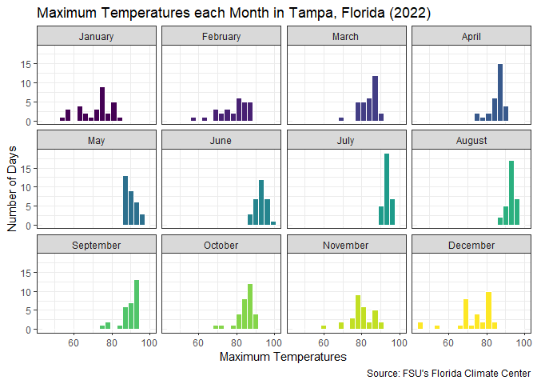
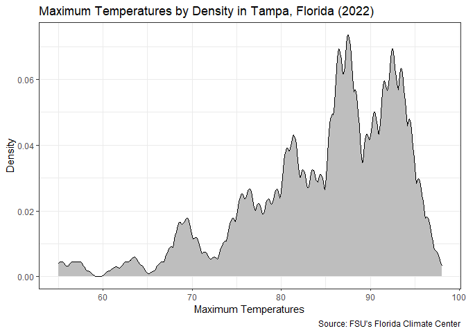
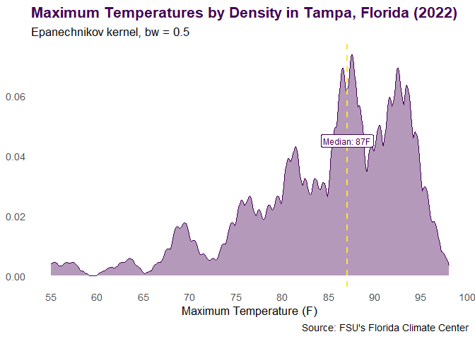
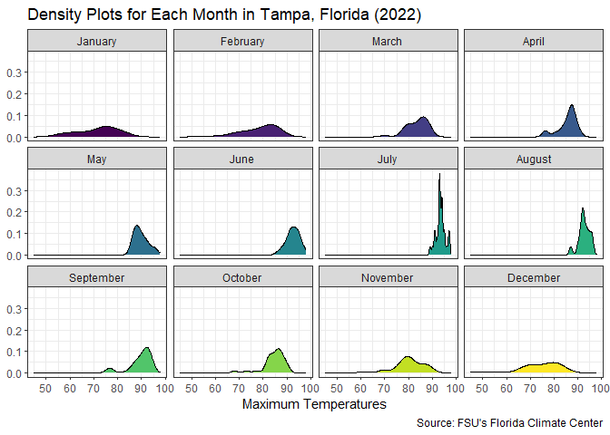
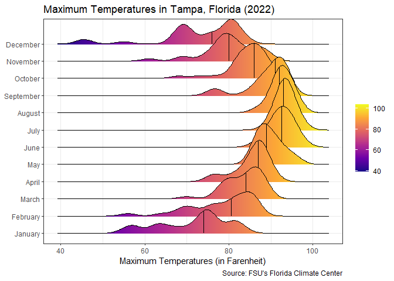
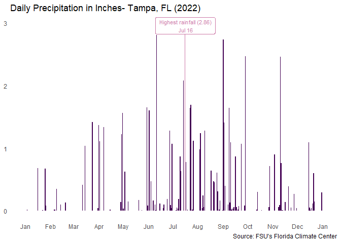
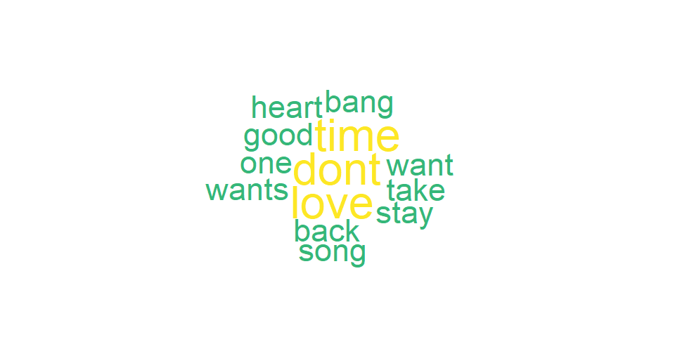

## Instructions

In this exercise you will explore methods to create different types of
data visualizations (such as plotting text data, or exploring the
distributions of continuous variables).

# PART 1: Density Plots

------------------------------------------------------------------------

Using the dataset obtained from FSU’s [Florida Climate
Center](https://climatecenter.fsu.edu/climate-data-access-tools/downloadable-data),
for a station at Tampa International Airport (TPA) for 2022, attempt to
recreate the charts shown below which were generated using data from
2016. You can read the 2022 dataset using the code below:

``` r
library(tidyverse)
library(dplyr)
library(gt)
library(plotly)
library(lubridate)
library(ggridges)
set.seed(636)
```

``` r
weather_tpa <- read_csv("https://raw.githubusercontent.com/aalhamadani/datasets/master/tpa_weather_2022.csv")

# random sample 
sample_n(weather_tpa, 4)
```

    ## # A tibble: 4 × 7
    ##    year month   day precipitation max_temp min_temp ave_temp
    ##   <dbl> <dbl> <dbl>         <dbl>    <dbl>    <dbl>    <dbl>
    ## 1  2022     3    16       0.00001       80       68     74  
    ## 2  2022     2     9       0.00001       69       49     59  
    ## 3  2022     1    23       0.00001       57       46     51.5
    ## 4  2022    11    19       0             75       53     64

``` r
glimpse(weather_tpa)
```

    ## Rows: 365
    ## Columns: 7
    ## $ year          <dbl> 2022, 2022, 2022, 2022, 2022, 2022, 2022, 2022, 2022, 20…
    ## $ month         <dbl> 1, 1, 1, 1, 1, 1, 1, 1, 1, 1, 1, 1, 1, 1, 1, 1, 1, 1, 1,…
    ## $ day           <dbl> 1, 2, 3, 4, 5, 6, 7, 8, 9, 10, 11, 12, 13, 14, 15, 16, 1…
    ## $ precipitation <dbl> 0.00000, 0.00000, 0.02000, 0.00000, 0.00000, 0.00001, 0.…
    ## $ max_temp      <dbl> 82, 82, 75, 76, 75, 74, 81, 81, 84, 81, 73, 77, 74, 72, …
    ## $ min_temp      <dbl> 67, 71, 55, 50, 59, 56, 63, 58, 65, 64, 54, 54, 59, 55, …
    ## $ ave_temp      <dbl> 74.5, 76.5, 65.0, 63.0, 67.0, 65.0, 72.0, 69.5, 74.5, 72…

See Slides from Week 4 of Visualizing Relationships and Models (slide
10) for a reminder on how to use this type of dataset with the
`lubridate` package for dates and times (example included in the slides
uses data from 2016).

Using the 2022 data:

1)  Create a plot like the one below:


Hint: the option `binwidth = 3` was used with the `geom_histogram()`
function.

``` r
weather_tpa <- weather_tpa %>% 
  mutate(
    date = make_date(year, month, day),
    month_name = month(date, label = TRUE, abbr = FALSE))
```

``` r
weather_tpa %>% 
  ggplot(aes(x = max_temp, fill = month_name)) +
  geom_histogram(binwidth = 3, color = "white") +
  facet_wrap(~month_name, nrow = 3)+
  scale_fill_viridis_d(guide = "none")+
  labs(
    title = "Maximum Temperatures each Month in Tampa, Florida (2022)",
    x = "Maximum Temperatures",
    y = "Number of Days",
    caption = "Source: FSU's Florida Climate Center"
  ) +
  theme_bw()
```



2)  Create a plot like the one below:


Hint: check the `kernel` parameter of the `geom_density()` function, and
use `bw = 0.5`.

#### Original

``` r
weather_tpa %>% 
  ggplot(aes(x=max_temp))+
  geom_density(kernel = "epanechnikov", bw = 0.5, fill = "gray", color = "black")+
  scale_x_continuous(limits = c(55, NA)) +
  labs(
    title = "Maximum Temperatures by Density in Tampa, Florida (2022)",
    x = "Maximum Temperatures",
    y = "Density",
    caption = "Source: FSU's Florida Climate Center"
  )+
  theme_bw()
```

    ## Warning: Removed 2 rows containing non-finite outside the scale range
    ## (`stat_density()`).



#### Redesign

``` r
weather_tpa %>%
  ggplot(aes(x = max_temp)) +
  geom_density(
    kernel = "epanechnikov", bw = 0.5,
    fill = "#440154", color = "#440154", alpha = 0.4
  ) +
  geom_vline(
    xintercept = median(weather_tpa$max_temp, na.rm = TRUE),
    linetype = "dashed", color = "#FDE725", linewidth = 0.8
  ) +
  annotate("label",
    x = median(weather_tpa$max_temp, na.rm = TRUE),
    y = 0.045,
    label = paste0("Median: ", median(weather_tpa$max_temp, na.rm = TRUE), "F"), 
    color = "#440154", fill = "white", size = 3.2, label.size = 0.4
  ) +
  scale_x_continuous(limits = c(55, NA), breaks = seq(55, 100, by = 5)) +
  labs(
    title = "Maximum Temperatures by Density in Tampa, Florida (2022)",
    subtitle = "Epanechnikov kernel, bw = 0.5",
    x = "Maximum Temperature (F)", 
    y = NULL,
    caption = "Source: FSU's Florida Climate Center"
  ) +
  theme_minimal(base_size = 13) +
  theme(
    plot.title = element_text(face = "bold", color = "#440154"),
    panel.grid.minor = element_blank(),
    panel.grid.major = element_blank()
  )
```



<p>
The redesign is meant to utilize the color scheme of viridis,simplify
the background, and point out the median with a label.
</p>

3)  Create a plot like the one below:


Hint: default options for `geom_density()` were used.

``` r
unique(weather_tpa$year)
```

    ## [1] 2022

``` r
weather_tpa %>% 
  ggplot(aes(x = max_temp, fill = month_name)) +
  geom_density()+
  facet_wrap(~month_name, nrow = 3)+
  scale_fill_viridis_d(guide = "none")+
  labs(
    title = "Density Plots for Each Month in Tampa, Florida (2022)",
    x = "Maximum Temperatures",
    y = NULL,
    caption = "Source: FSU's Florida Climate Center") +
  theme_bw()
```



4)  Generate a plot like the chart below:


Hint: use the`{ggridges}` package, and the `geom_density_ridges()`
function paying close attention to the `quantile_lines` and `quantiles`
parameters. The plot above uses the `plasma` option (color scale) for
the *viridis* palette.

``` r
weather_tpa %>% 
  ggplot(aes(x =max_temp, y = month_name, fill = after_stat(x))) +
  geom_density_ridges_gradient(quantile_lines = TRUE,
                      quantiles = 2,
                      scale = 3)+
  scale_fill_viridis_c(option = "plasma", name = "")+
  labs(
    title = "Maximum Temperatures in Tampa, Florida (2022)",
    x = "Maximum Temperatures (in Farenheit)",
    y = NULL,
    caption = "Source: FSU's Florida Climate Center")+
  theme_bw()
```



5)  Create a plot of your choice that uses the attribute for
    precipitation *(values of -99.9 for temperature or -99.99 for
    precipitation represent missing data)*.

``` r
glimpse(weather_tpa)
```

    ## Rows: 365
    ## Columns: 9
    ## $ year          <dbl> 2022, 2022, 2022, 2022, 2022, 2022, 2022, 2022, 2022, 20…
    ## $ month         <dbl> 1, 1, 1, 1, 1, 1, 1, 1, 1, 1, 1, 1, 1, 1, 1, 1, 1, 1, 1,…
    ## $ day           <dbl> 1, 2, 3, 4, 5, 6, 7, 8, 9, 10, 11, 12, 13, 14, 15, 16, 1…
    ## $ precipitation <dbl> 0.00000, 0.00000, 0.02000, 0.00000, 0.00000, 0.00001, 0.…
    ## $ max_temp      <dbl> 82, 82, 75, 76, 75, 74, 81, 81, 84, 81, 73, 77, 74, 72, …
    ## $ min_temp      <dbl> 67, 71, 55, 50, 59, 56, 63, 58, 65, 64, 54, 54, 59, 55, …
    ## $ ave_temp      <dbl> 74.5, 76.5, 65.0, 63.0, 67.0, 65.0, 72.0, 69.5, 74.5, 72…
    ## $ date          <date> 2022-01-01, 2022-01-02, 2022-01-03, 2022-01-04, 2022-01…
    ## $ month_name    <ord> January, January, January, January, January, January, Ja…

``` r
weather_tpa %>%
  filter(precipitation != -99.99) %>%
  mutate(is_max = precipitation == max(precipitation)) %>%
  ggplot(aes(x = date, y = precipitation, fill = is_max)) +
  geom_col() +
  geom_label(
    data = . %>% filter(precipitation == max(precipitation)),
    aes(label = paste("Highest rainfall (2.86   )\n", format(date, "%b %d"))),
    fill = "white",
    color = "#CC79A7",
    nudge_y = 0.1,
    size = 3
  ) +
  scale_fill_manual(
    values = c("FALSE" = "#440154", "TRUE" = "#CC79A7"),
    guide = "none"
  ) +
  scale_x_date(date_labels = "%b", date_breaks = "1 month") +
  labs(
    title = "Daily Precipitation in Inches- Tampa, FL (2022)",
    x = NULL,
    y = NULL,
    caption = "Source: FSU's Florida Climate Center") +
  theme_minimal() +
  theme(panel.grid = element_blank())
```



# PART 2: Billboard Hits 2015

------------------------------------------------------------------------

### Option (A): Visualizing Text Data

Review the set of slides (and additional resources linked in it) for
visualizing text data: Week 6 PowerPoint slides of Visualizing Text
Data.

Choose any dataset with text data, and create at least one visualization
with it. For example, you can create a frequency count of most used
bigrams, a sentiment analysis of the text data, a network visualization
of terms commonly used together, and/or a visualization of a topic
modeling approach to the problem of identifying words/documents
associated to different topics in the text data you decide to use.

Make sure to include a copy of the dataset in the `data/` folder, and
reference your sources if different from the ones listed below:

- [Billboard Top 100
  Lyrics](https://raw.githubusercontent.com/aalhamadani/dataviz_final_project/main/data/BB_top100_2015.csv)

- [RateMyProfessors
  comments](https://raw.githubusercontent.com/aalhamadani/dataviz_final_project/main/data/rmp_wit_comments.csv)

- [FL Poly News
  Articles](https://raw.githubusercontent.com/aalhamadani/dataviz_final_project/main/data/flpoly_news_SP23.csv)

## Pre-requisites

``` r
library(tidytext)
library(wordcloud2)
library(htmltools)
library(stopwords)
library(wordcloud)
```

    ## Loading required package: RColorBrewer

``` r
spotifyURL <- "https://raw.githubusercontent.com/aalhamadani/dataviz_final_project/main/data/BB_top100_2015.csv"
billboard <- read_csv(spotifyURL)
```

``` r
head(billboard)
```

    ## # A tibble: 6 × 6
    ##    Rank Song              Artist                              Year Lyrics Source
    ##   <dbl> <chr>             <chr>                              <dbl> <chr>   <dbl>
    ## 1     1 uptown funk       mark ronson featuring bruno mars    2015 this …      1
    ## 2     2 thinking out loud ed sheeran                          2015 when …      1
    ## 3     3 see you again     wiz khalifa featuring charlie puth  2015 its b…      1
    ## 4     4 trap queen        fetty wap                           2015 im li…      1
    ## 5     5 sugar             maroon 5                            2015 im hu…      1
    ## 6     6 shut up and dance walk the moon                       2015 oh do…      1

``` r
glimpse(billboard)
```

    ## Rows: 100
    ## Columns: 6
    ## $ Rank   <dbl> 1, 2, 3, 4, 5, 6, 7, 8, 9, 10, 11, 12, 13, 14, 15, 16, 17, 18, …
    ## $ Song   <chr> "uptown funk", "thinking out loud", "see you again", "trap quee…
    ## $ Artist <chr> "mark ronson featuring bruno mars", "ed sheeran", "wiz khalifa …
    ## $ Year   <dbl> 2015, 2015, 2015, 2015, 2015, 2015, 2015, 2015, 2015, 2015, 201…
    ## $ Lyrics <chr> "this hit that ice cold michelle pfeiffer that white gold this …
    ## $ Source <dbl> 1, 1, 1, 1, 1, 1, 1, 1, 1, 1, 1, 1, 1, 1, 1, 1, 1, 1, 1, 1, 1, …

## Data Cleaning/Wrangling

``` r
colSums(is.na(billboard))
```

    ##   Rank   Song Artist   Year Lyrics Source 
    ##      0      0      0      0      2      2

``` r
billboard %>% 
  filter(is.na(Lyrics)) %>% 
  gt() %>%
  tab_header(title = "Songs with Missing Lyrics") %>%
  tab_style(
    style = cell_fill(color = "#FDE725"),
    locations = cells_body(columns = Lyrics)) %>%
  tab_options(
    table.font.size = px(14),
    heading.title.font.size = px(18),
    column_labels.font.weight = "bold")
```

<div id="ezysbrwydb" style="padding-left:0px;padding-right:0px;padding-top:10px;padding-bottom:10px;overflow-x:auto;overflow-y:auto;width:auto;height:auto;">
<style>#ezysbrwydb table {
  font-family: system-ui, 'Segoe UI', Roboto, Helvetica, Arial, sans-serif, 'Apple Color Emoji', 'Segoe UI Emoji', 'Segoe UI Symbol', 'Noto Color Emoji';
  -webkit-font-smoothing: antialiased;
  -moz-osx-font-smoothing: grayscale;
}
&#10;#ezysbrwydb thead, #ezysbrwydb tbody, #ezysbrwydb tfoot, #ezysbrwydb tr, #ezysbrwydb td, #ezysbrwydb th {
  border-style: none;
}
&#10;#ezysbrwydb p {
  margin: 0;
  padding: 0;
}
&#10;#ezysbrwydb .gt_table {
  display: table;
  border-collapse: collapse;
  line-height: normal;
  margin-left: auto;
  margin-right: auto;
  color: #333333;
  font-size: 14px;
  font-weight: normal;
  font-style: normal;
  background-color: #FFFFFF;
  width: auto;
  border-top-style: solid;
  border-top-width: 2px;
  border-top-color: #A8A8A8;
  border-right-style: none;
  border-right-width: 2px;
  border-right-color: #D3D3D3;
  border-bottom-style: solid;
  border-bottom-width: 2px;
  border-bottom-color: #A8A8A8;
  border-left-style: none;
  border-left-width: 2px;
  border-left-color: #D3D3D3;
}
&#10;#ezysbrwydb .gt_caption {
  padding-top: 4px;
  padding-bottom: 4px;
}
&#10;#ezysbrwydb .gt_title {
  color: #333333;
  font-size: 18px;
  font-weight: initial;
  padding-top: 4px;
  padding-bottom: 4px;
  padding-left: 5px;
  padding-right: 5px;
  border-bottom-color: #FFFFFF;
  border-bottom-width: 0;
}
&#10;#ezysbrwydb .gt_subtitle {
  color: #333333;
  font-size: 85%;
  font-weight: initial;
  padding-top: 3px;
  padding-bottom: 5px;
  padding-left: 5px;
  padding-right: 5px;
  border-top-color: #FFFFFF;
  border-top-width: 0;
}
&#10;#ezysbrwydb .gt_heading {
  background-color: #FFFFFF;
  text-align: center;
  border-bottom-color: #FFFFFF;
  border-left-style: none;
  border-left-width: 1px;
  border-left-color: #D3D3D3;
  border-right-style: none;
  border-right-width: 1px;
  border-right-color: #D3D3D3;
}
&#10;#ezysbrwydb .gt_bottom_border {
  border-bottom-style: solid;
  border-bottom-width: 2px;
  border-bottom-color: #D3D3D3;
}
&#10;#ezysbrwydb .gt_col_headings {
  border-top-style: solid;
  border-top-width: 2px;
  border-top-color: #D3D3D3;
  border-bottom-style: solid;
  border-bottom-width: 2px;
  border-bottom-color: #D3D3D3;
  border-left-style: none;
  border-left-width: 1px;
  border-left-color: #D3D3D3;
  border-right-style: none;
  border-right-width: 1px;
  border-right-color: #D3D3D3;
}
&#10;#ezysbrwydb .gt_col_heading {
  color: #333333;
  background-color: #FFFFFF;
  font-size: 100%;
  font-weight: bold;
  text-transform: inherit;
  border-left-style: none;
  border-left-width: 1px;
  border-left-color: #D3D3D3;
  border-right-style: none;
  border-right-width: 1px;
  border-right-color: #D3D3D3;
  vertical-align: bottom;
  padding-top: 5px;
  padding-bottom: 6px;
  padding-left: 5px;
  padding-right: 5px;
  overflow-x: hidden;
}
&#10;#ezysbrwydb .gt_column_spanner_outer {
  color: #333333;
  background-color: #FFFFFF;
  font-size: 100%;
  font-weight: bold;
  text-transform: inherit;
  padding-top: 0;
  padding-bottom: 0;
  padding-left: 4px;
  padding-right: 4px;
}
&#10;#ezysbrwydb .gt_column_spanner_outer:first-child {
  padding-left: 0;
}
&#10;#ezysbrwydb .gt_column_spanner_outer:last-child {
  padding-right: 0;
}
&#10;#ezysbrwydb .gt_column_spanner {
  border-bottom-style: solid;
  border-bottom-width: 2px;
  border-bottom-color: #D3D3D3;
  vertical-align: bottom;
  padding-top: 5px;
  padding-bottom: 5px;
  overflow-x: hidden;
  display: inline-block;
  width: 100%;
}
&#10;#ezysbrwydb .gt_spanner_row {
  border-bottom-style: hidden;
}
&#10;#ezysbrwydb .gt_group_heading {
  padding-top: 8px;
  padding-bottom: 8px;
  padding-left: 5px;
  padding-right: 5px;
  color: #333333;
  background-color: #FFFFFF;
  font-size: 100%;
  font-weight: initial;
  text-transform: inherit;
  border-top-style: solid;
  border-top-width: 2px;
  border-top-color: #D3D3D3;
  border-bottom-style: solid;
  border-bottom-width: 2px;
  border-bottom-color: #D3D3D3;
  border-left-style: none;
  border-left-width: 1px;
  border-left-color: #D3D3D3;
  border-right-style: none;
  border-right-width: 1px;
  border-right-color: #D3D3D3;
  vertical-align: middle;
  text-align: left;
}
&#10;#ezysbrwydb .gt_empty_group_heading {
  padding: 0.5px;
  color: #333333;
  background-color: #FFFFFF;
  font-size: 100%;
  font-weight: initial;
  border-top-style: solid;
  border-top-width: 2px;
  border-top-color: #D3D3D3;
  border-bottom-style: solid;
  border-bottom-width: 2px;
  border-bottom-color: #D3D3D3;
  vertical-align: middle;
}
&#10;#ezysbrwydb .gt_from_md > :first-child {
  margin-top: 0;
}
&#10;#ezysbrwydb .gt_from_md > :last-child {
  margin-bottom: 0;
}
&#10;#ezysbrwydb .gt_row {
  padding-top: 8px;
  padding-bottom: 8px;
  padding-left: 5px;
  padding-right: 5px;
  margin: 10px;
  border-top-style: solid;
  border-top-width: 1px;
  border-top-color: #D3D3D3;
  border-left-style: none;
  border-left-width: 1px;
  border-left-color: #D3D3D3;
  border-right-style: none;
  border-right-width: 1px;
  border-right-color: #D3D3D3;
  vertical-align: middle;
  overflow-x: hidden;
}
&#10;#ezysbrwydb .gt_stub {
  color: #333333;
  background-color: #FFFFFF;
  font-size: 100%;
  font-weight: initial;
  text-transform: inherit;
  border-right-style: solid;
  border-right-width: 2px;
  border-right-color: #D3D3D3;
  padding-left: 5px;
  padding-right: 5px;
}
&#10;#ezysbrwydb .gt_stub_row_group {
  color: #333333;
  background-color: #FFFFFF;
  font-size: 100%;
  font-weight: initial;
  text-transform: inherit;
  border-right-style: solid;
  border-right-width: 2px;
  border-right-color: #D3D3D3;
  padding-left: 5px;
  padding-right: 5px;
  vertical-align: top;
}
&#10;#ezysbrwydb .gt_row_group_first td {
  border-top-width: 2px;
}
&#10;#ezysbrwydb .gt_row_group_first th {
  border-top-width: 2px;
}
&#10;#ezysbrwydb .gt_summary_row {
  color: #333333;
  background-color: #FFFFFF;
  text-transform: inherit;
  padding-top: 8px;
  padding-bottom: 8px;
  padding-left: 5px;
  padding-right: 5px;
}
&#10;#ezysbrwydb .gt_first_summary_row {
  border-top-style: solid;
  border-top-color: #D3D3D3;
}
&#10;#ezysbrwydb .gt_first_summary_row.thick {
  border-top-width: 2px;
}
&#10;#ezysbrwydb .gt_last_summary_row {
  padding-top: 8px;
  padding-bottom: 8px;
  padding-left: 5px;
  padding-right: 5px;
  border-bottom-style: solid;
  border-bottom-width: 2px;
  border-bottom-color: #D3D3D3;
}
&#10;#ezysbrwydb .gt_grand_summary_row {
  color: #333333;
  background-color: #FFFFFF;
  text-transform: inherit;
  padding-top: 8px;
  padding-bottom: 8px;
  padding-left: 5px;
  padding-right: 5px;
}
&#10;#ezysbrwydb .gt_first_grand_summary_row {
  padding-top: 8px;
  padding-bottom: 8px;
  padding-left: 5px;
  padding-right: 5px;
  border-top-style: double;
  border-top-width: 6px;
  border-top-color: #D3D3D3;
}
&#10;#ezysbrwydb .gt_last_grand_summary_row_top {
  padding-top: 8px;
  padding-bottom: 8px;
  padding-left: 5px;
  padding-right: 5px;
  border-bottom-style: double;
  border-bottom-width: 6px;
  border-bottom-color: #D3D3D3;
}
&#10;#ezysbrwydb .gt_striped {
  background-color: rgba(128, 128, 128, 0.05);
}
&#10;#ezysbrwydb .gt_table_body {
  border-top-style: solid;
  border-top-width: 2px;
  border-top-color: #D3D3D3;
  border-bottom-style: solid;
  border-bottom-width: 2px;
  border-bottom-color: #D3D3D3;
}
&#10;#ezysbrwydb .gt_footnotes {
  color: #333333;
  background-color: #FFFFFF;
  border-bottom-style: none;
  border-bottom-width: 2px;
  border-bottom-color: #D3D3D3;
  border-left-style: none;
  border-left-width: 2px;
  border-left-color: #D3D3D3;
  border-right-style: none;
  border-right-width: 2px;
  border-right-color: #D3D3D3;
}
&#10;#ezysbrwydb .gt_footnote {
  margin: 0px;
  font-size: 90%;
  padding-top: 4px;
  padding-bottom: 4px;
  padding-left: 5px;
  padding-right: 5px;
}
&#10;#ezysbrwydb .gt_sourcenotes {
  color: #333333;
  background-color: #FFFFFF;
  border-bottom-style: none;
  border-bottom-width: 2px;
  border-bottom-color: #D3D3D3;
  border-left-style: none;
  border-left-width: 2px;
  border-left-color: #D3D3D3;
  border-right-style: none;
  border-right-width: 2px;
  border-right-color: #D3D3D3;
}
&#10;#ezysbrwydb .gt_sourcenote {
  font-size: 90%;
  padding-top: 4px;
  padding-bottom: 4px;
  padding-left: 5px;
  padding-right: 5px;
}
&#10;#ezysbrwydb .gt_left {
  text-align: left;
}
&#10;#ezysbrwydb .gt_center {
  text-align: center;
}
&#10;#ezysbrwydb .gt_right {
  text-align: right;
  font-variant-numeric: tabular-nums;
}
&#10;#ezysbrwydb .gt_font_normal {
  font-weight: normal;
}
&#10;#ezysbrwydb .gt_font_bold {
  font-weight: bold;
}
&#10;#ezysbrwydb .gt_font_italic {
  font-style: italic;
}
&#10;#ezysbrwydb .gt_super {
  font-size: 65%;
}
&#10;#ezysbrwydb .gt_footnote_marks {
  font-size: 75%;
  vertical-align: 0.4em;
  position: initial;
}
&#10;#ezysbrwydb .gt_asterisk {
  font-size: 100%;
  vertical-align: 0;
}
&#10;#ezysbrwydb .gt_indent_1 {
  text-indent: 5px;
}
&#10;#ezysbrwydb .gt_indent_2 {
  text-indent: 10px;
}
&#10;#ezysbrwydb .gt_indent_3 {
  text-indent: 15px;
}
&#10;#ezysbrwydb .gt_indent_4 {
  text-indent: 20px;
}
&#10;#ezysbrwydb .gt_indent_5 {
  text-indent: 25px;
}
&#10;#ezysbrwydb .katex-display {
  display: inline-flex !important;
  margin-bottom: 0.75em !important;
}
&#10;#ezysbrwydb div.Reactable > div.rt-table > div.rt-thead > div.rt-tr.rt-tr-group-header > div.rt-th-group:after {
  height: 0px !important;
}
</style>
<table class="gt_table" data-quarto-disable-processing="false" data-quarto-bootstrap="false">
  <thead>
    <tr class="gt_heading">
      <td colspan="6" class="gt_heading gt_title gt_font_normal gt_bottom_border" style>Songs with Missing Lyrics</td>
    </tr>
    &#10;    <tr class="gt_col_headings">
      <th class="gt_col_heading gt_columns_bottom_border gt_right" rowspan="1" colspan="1" scope="col" id="Rank">Rank</th>
      <th class="gt_col_heading gt_columns_bottom_border gt_left" rowspan="1" colspan="1" scope="col" id="Song">Song</th>
      <th class="gt_col_heading gt_columns_bottom_border gt_left" rowspan="1" colspan="1" scope="col" id="Artist">Artist</th>
      <th class="gt_col_heading gt_columns_bottom_border gt_right" rowspan="1" colspan="1" scope="col" id="Year">Year</th>
      <th class="gt_col_heading gt_columns_bottom_border gt_left" rowspan="1" colspan="1" scope="col" id="Lyrics">Lyrics</th>
      <th class="gt_col_heading gt_columns_bottom_border gt_right" rowspan="1" colspan="1" scope="col" id="Source">Source</th>
    </tr>
  </thead>
  <tbody class="gt_table_body">
    <tr><td headers="Rank" class="gt_row gt_right">50</td>
<td headers="Song" class="gt_row gt_left">nasty freestyle</td>
<td headers="Artist" class="gt_row gt_left">twayne</td>
<td headers="Year" class="gt_row gt_right">2015</td>
<td headers="Lyrics" class="gt_row gt_left" style="background-color: #FDE725;">NA</td>
<td headers="Source" class="gt_row gt_right">NA</td></tr>
    <tr><td headers="Rank" class="gt_row gt_right">97</td>
<td headers="Song" class="gt_row gt_left">she knows</td>
<td headers="Artist" class="gt_row gt_left">neyo featuring juicy j</td>
<td headers="Year" class="gt_row gt_right">2015</td>
<td headers="Lyrics" class="gt_row gt_left" style="background-color: #FDE725;">NA</td>
<td headers="Source" class="gt_row gt_right">NA</td></tr>
  </tbody>
  &#10;  
</table>
</div>
<p>
Out of 100 observations, there are two songs: **nasty style** by Twayne
and **she knows** by Neyo, that do not have the lyrics. With the limited
observations, it’s important to note that any visualizations are
composed of 98 observations. However, I will be keeping the observations
to utilize the title.
</p>

``` r
billboard %>% 
  count(Song,Artist,Lyrics) %>% 
  filter(n>1)
```

    ## # A tibble: 0 × 4
    ## # ℹ 4 variables: Song <chr>, Artist <chr>, Lyrics <chr>, n <int>

``` r
sum(duplicated(billboard))
```

    ## [1] 0

<p>
There are no recorded duplicated observations.
</p>

``` r
billboard %>% 
  filter(str_detect(Lyrics, fixed("*"))) %>% 
  select(Song, Artist, Lyrics) %>% 
  head()
```

    ## # A tibble: 6 × 3
    ##   Song                 Artist                                             Lyrics
    ##   <chr>                <chr>                                              <chr> 
    ## 1 trap queen           fetty wap                                          im li…
    ## 2 the hills            the weeknd                                         your …
    ## 3 hey mama             david guetta featuring nicki minaj bebe rexha and… be my…
    ## 4 talking body         tove lo                                            bed s…
    ## 5 my way               fetty wap featuring monty                          baby …
    ## 6 i dont fuck with you big sean featuring e40                             i don…

``` r
billboard %>%
  filter(str_detect(Lyrics, fixed("*"))) %>%
  mutate(censored_words = str_extract_all(Lyrics, "\\w*\\*+\\w*")) %>%
  select(Song, Artist, censored_words) %>%
  unnest(censored_words) %>%
  distinct(censored_words) %>% 
  gt() %>%
  tab_header(title = "Censored Words Found in Lyrics") %>%
  cols_label(censored_words = "Word") %>%
  cols_align(align = "center", columns = everything()) %>%
  tab_options(
    table.font.size = px(14),
    heading.title.font.size = px(18),
    column_labels.font.weight = "bold")
```

<div id="xlhkjkwlxe" style="padding-left:0px;padding-right:0px;padding-top:10px;padding-bottom:10px;overflow-x:auto;overflow-y:auto;width:auto;height:auto;">
<style>#xlhkjkwlxe table {
  font-family: system-ui, 'Segoe UI', Roboto, Helvetica, Arial, sans-serif, 'Apple Color Emoji', 'Segoe UI Emoji', 'Segoe UI Symbol', 'Noto Color Emoji';
  -webkit-font-smoothing: antialiased;
  -moz-osx-font-smoothing: grayscale;
}
&#10;#xlhkjkwlxe thead, #xlhkjkwlxe tbody, #xlhkjkwlxe tfoot, #xlhkjkwlxe tr, #xlhkjkwlxe td, #xlhkjkwlxe th {
  border-style: none;
}
&#10;#xlhkjkwlxe p {
  margin: 0;
  padding: 0;
}
&#10;#xlhkjkwlxe .gt_table {
  display: table;
  border-collapse: collapse;
  line-height: normal;
  margin-left: auto;
  margin-right: auto;
  color: #333333;
  font-size: 14px;
  font-weight: normal;
  font-style: normal;
  background-color: #FFFFFF;
  width: auto;
  border-top-style: solid;
  border-top-width: 2px;
  border-top-color: #A8A8A8;
  border-right-style: none;
  border-right-width: 2px;
  border-right-color: #D3D3D3;
  border-bottom-style: solid;
  border-bottom-width: 2px;
  border-bottom-color: #A8A8A8;
  border-left-style: none;
  border-left-width: 2px;
  border-left-color: #D3D3D3;
}
&#10;#xlhkjkwlxe .gt_caption {
  padding-top: 4px;
  padding-bottom: 4px;
}
&#10;#xlhkjkwlxe .gt_title {
  color: #333333;
  font-size: 18px;
  font-weight: initial;
  padding-top: 4px;
  padding-bottom: 4px;
  padding-left: 5px;
  padding-right: 5px;
  border-bottom-color: #FFFFFF;
  border-bottom-width: 0;
}
&#10;#xlhkjkwlxe .gt_subtitle {
  color: #333333;
  font-size: 85%;
  font-weight: initial;
  padding-top: 3px;
  padding-bottom: 5px;
  padding-left: 5px;
  padding-right: 5px;
  border-top-color: #FFFFFF;
  border-top-width: 0;
}
&#10;#xlhkjkwlxe .gt_heading {
  background-color: #FFFFFF;
  text-align: center;
  border-bottom-color: #FFFFFF;
  border-left-style: none;
  border-left-width: 1px;
  border-left-color: #D3D3D3;
  border-right-style: none;
  border-right-width: 1px;
  border-right-color: #D3D3D3;
}
&#10;#xlhkjkwlxe .gt_bottom_border {
  border-bottom-style: solid;
  border-bottom-width: 2px;
  border-bottom-color: #D3D3D3;
}
&#10;#xlhkjkwlxe .gt_col_headings {
  border-top-style: solid;
  border-top-width: 2px;
  border-top-color: #D3D3D3;
  border-bottom-style: solid;
  border-bottom-width: 2px;
  border-bottom-color: #D3D3D3;
  border-left-style: none;
  border-left-width: 1px;
  border-left-color: #D3D3D3;
  border-right-style: none;
  border-right-width: 1px;
  border-right-color: #D3D3D3;
}
&#10;#xlhkjkwlxe .gt_col_heading {
  color: #333333;
  background-color: #FFFFFF;
  font-size: 100%;
  font-weight: bold;
  text-transform: inherit;
  border-left-style: none;
  border-left-width: 1px;
  border-left-color: #D3D3D3;
  border-right-style: none;
  border-right-width: 1px;
  border-right-color: #D3D3D3;
  vertical-align: bottom;
  padding-top: 5px;
  padding-bottom: 6px;
  padding-left: 5px;
  padding-right: 5px;
  overflow-x: hidden;
}
&#10;#xlhkjkwlxe .gt_column_spanner_outer {
  color: #333333;
  background-color: #FFFFFF;
  font-size: 100%;
  font-weight: bold;
  text-transform: inherit;
  padding-top: 0;
  padding-bottom: 0;
  padding-left: 4px;
  padding-right: 4px;
}
&#10;#xlhkjkwlxe .gt_column_spanner_outer:first-child {
  padding-left: 0;
}
&#10;#xlhkjkwlxe .gt_column_spanner_outer:last-child {
  padding-right: 0;
}
&#10;#xlhkjkwlxe .gt_column_spanner {
  border-bottom-style: solid;
  border-bottom-width: 2px;
  border-bottom-color: #D3D3D3;
  vertical-align: bottom;
  padding-top: 5px;
  padding-bottom: 5px;
  overflow-x: hidden;
  display: inline-block;
  width: 100%;
}
&#10;#xlhkjkwlxe .gt_spanner_row {
  border-bottom-style: hidden;
}
&#10;#xlhkjkwlxe .gt_group_heading {
  padding-top: 8px;
  padding-bottom: 8px;
  padding-left: 5px;
  padding-right: 5px;
  color: #333333;
  background-color: #FFFFFF;
  font-size: 100%;
  font-weight: initial;
  text-transform: inherit;
  border-top-style: solid;
  border-top-width: 2px;
  border-top-color: #D3D3D3;
  border-bottom-style: solid;
  border-bottom-width: 2px;
  border-bottom-color: #D3D3D3;
  border-left-style: none;
  border-left-width: 1px;
  border-left-color: #D3D3D3;
  border-right-style: none;
  border-right-width: 1px;
  border-right-color: #D3D3D3;
  vertical-align: middle;
  text-align: left;
}
&#10;#xlhkjkwlxe .gt_empty_group_heading {
  padding: 0.5px;
  color: #333333;
  background-color: #FFFFFF;
  font-size: 100%;
  font-weight: initial;
  border-top-style: solid;
  border-top-width: 2px;
  border-top-color: #D3D3D3;
  border-bottom-style: solid;
  border-bottom-width: 2px;
  border-bottom-color: #D3D3D3;
  vertical-align: middle;
}
&#10;#xlhkjkwlxe .gt_from_md > :first-child {
  margin-top: 0;
}
&#10;#xlhkjkwlxe .gt_from_md > :last-child {
  margin-bottom: 0;
}
&#10;#xlhkjkwlxe .gt_row {
  padding-top: 8px;
  padding-bottom: 8px;
  padding-left: 5px;
  padding-right: 5px;
  margin: 10px;
  border-top-style: solid;
  border-top-width: 1px;
  border-top-color: #D3D3D3;
  border-left-style: none;
  border-left-width: 1px;
  border-left-color: #D3D3D3;
  border-right-style: none;
  border-right-width: 1px;
  border-right-color: #D3D3D3;
  vertical-align: middle;
  overflow-x: hidden;
}
&#10;#xlhkjkwlxe .gt_stub {
  color: #333333;
  background-color: #FFFFFF;
  font-size: 100%;
  font-weight: initial;
  text-transform: inherit;
  border-right-style: solid;
  border-right-width: 2px;
  border-right-color: #D3D3D3;
  padding-left: 5px;
  padding-right: 5px;
}
&#10;#xlhkjkwlxe .gt_stub_row_group {
  color: #333333;
  background-color: #FFFFFF;
  font-size: 100%;
  font-weight: initial;
  text-transform: inherit;
  border-right-style: solid;
  border-right-width: 2px;
  border-right-color: #D3D3D3;
  padding-left: 5px;
  padding-right: 5px;
  vertical-align: top;
}
&#10;#xlhkjkwlxe .gt_row_group_first td {
  border-top-width: 2px;
}
&#10;#xlhkjkwlxe .gt_row_group_first th {
  border-top-width: 2px;
}
&#10;#xlhkjkwlxe .gt_summary_row {
  color: #333333;
  background-color: #FFFFFF;
  text-transform: inherit;
  padding-top: 8px;
  padding-bottom: 8px;
  padding-left: 5px;
  padding-right: 5px;
}
&#10;#xlhkjkwlxe .gt_first_summary_row {
  border-top-style: solid;
  border-top-color: #D3D3D3;
}
&#10;#xlhkjkwlxe .gt_first_summary_row.thick {
  border-top-width: 2px;
}
&#10;#xlhkjkwlxe .gt_last_summary_row {
  padding-top: 8px;
  padding-bottom: 8px;
  padding-left: 5px;
  padding-right: 5px;
  border-bottom-style: solid;
  border-bottom-width: 2px;
  border-bottom-color: #D3D3D3;
}
&#10;#xlhkjkwlxe .gt_grand_summary_row {
  color: #333333;
  background-color: #FFFFFF;
  text-transform: inherit;
  padding-top: 8px;
  padding-bottom: 8px;
  padding-left: 5px;
  padding-right: 5px;
}
&#10;#xlhkjkwlxe .gt_first_grand_summary_row {
  padding-top: 8px;
  padding-bottom: 8px;
  padding-left: 5px;
  padding-right: 5px;
  border-top-style: double;
  border-top-width: 6px;
  border-top-color: #D3D3D3;
}
&#10;#xlhkjkwlxe .gt_last_grand_summary_row_top {
  padding-top: 8px;
  padding-bottom: 8px;
  padding-left: 5px;
  padding-right: 5px;
  border-bottom-style: double;
  border-bottom-width: 6px;
  border-bottom-color: #D3D3D3;
}
&#10;#xlhkjkwlxe .gt_striped {
  background-color: rgba(128, 128, 128, 0.05);
}
&#10;#xlhkjkwlxe .gt_table_body {
  border-top-style: solid;
  border-top-width: 2px;
  border-top-color: #D3D3D3;
  border-bottom-style: solid;
  border-bottom-width: 2px;
  border-bottom-color: #D3D3D3;
}
&#10;#xlhkjkwlxe .gt_footnotes {
  color: #333333;
  background-color: #FFFFFF;
  border-bottom-style: none;
  border-bottom-width: 2px;
  border-bottom-color: #D3D3D3;
  border-left-style: none;
  border-left-width: 2px;
  border-left-color: #D3D3D3;
  border-right-style: none;
  border-right-width: 2px;
  border-right-color: #D3D3D3;
}
&#10;#xlhkjkwlxe .gt_footnote {
  margin: 0px;
  font-size: 90%;
  padding-top: 4px;
  padding-bottom: 4px;
  padding-left: 5px;
  padding-right: 5px;
}
&#10;#xlhkjkwlxe .gt_sourcenotes {
  color: #333333;
  background-color: #FFFFFF;
  border-bottom-style: none;
  border-bottom-width: 2px;
  border-bottom-color: #D3D3D3;
  border-left-style: none;
  border-left-width: 2px;
  border-left-color: #D3D3D3;
  border-right-style: none;
  border-right-width: 2px;
  border-right-color: #D3D3D3;
}
&#10;#xlhkjkwlxe .gt_sourcenote {
  font-size: 90%;
  padding-top: 4px;
  padding-bottom: 4px;
  padding-left: 5px;
  padding-right: 5px;
}
&#10;#xlhkjkwlxe .gt_left {
  text-align: left;
}
&#10;#xlhkjkwlxe .gt_center {
  text-align: center;
}
&#10;#xlhkjkwlxe .gt_right {
  text-align: right;
  font-variant-numeric: tabular-nums;
}
&#10;#xlhkjkwlxe .gt_font_normal {
  font-weight: normal;
}
&#10;#xlhkjkwlxe .gt_font_bold {
  font-weight: bold;
}
&#10;#xlhkjkwlxe .gt_font_italic {
  font-style: italic;
}
&#10;#xlhkjkwlxe .gt_super {
  font-size: 65%;
}
&#10;#xlhkjkwlxe .gt_footnote_marks {
  font-size: 75%;
  vertical-align: 0.4em;
  position: initial;
}
&#10;#xlhkjkwlxe .gt_asterisk {
  font-size: 100%;
  vertical-align: 0;
}
&#10;#xlhkjkwlxe .gt_indent_1 {
  text-indent: 5px;
}
&#10;#xlhkjkwlxe .gt_indent_2 {
  text-indent: 10px;
}
&#10;#xlhkjkwlxe .gt_indent_3 {
  text-indent: 15px;
}
&#10;#xlhkjkwlxe .gt_indent_4 {
  text-indent: 20px;
}
&#10;#xlhkjkwlxe .gt_indent_5 {
  text-indent: 25px;
}
&#10;#xlhkjkwlxe .katex-display {
  display: inline-flex !important;
  margin-bottom: 0.75em !important;
}
&#10;#xlhkjkwlxe div.Reactable > div.rt-table > div.rt-thead > div.rt-tr.rt-tr-group-header > div.rt-th-group:after {
  height: 0px !important;
}
</style>
<table class="gt_table" data-quarto-disable-processing="false" data-quarto-bootstrap="false">
  <thead>
    <tr class="gt_heading">
      <td colspan="1" class="gt_heading gt_title gt_font_normal gt_bottom_border" style>Censored Words Found in Lyrics</td>
    </tr>
    &#10;    <tr class="gt_col_headings">
      <th class="gt_col_heading gt_columns_bottom_border gt_center" rowspan="1" colspan="1" scope="col" id="censored_words">Word</th>
    </tr>
  </thead>
  <tbody class="gt_table_body">
    <tr><td headers="censored_words" class="gt_row gt_center">f*ck</td></tr>
    <tr><td headers="censored_words" class="gt_row gt_center">f*cked</td></tr>
    <tr><td headers="censored_words" class="gt_row gt_center">motherf*ckers</td></tr>
    <tr><td headers="censored_words" class="gt_row gt_center">f*ckin</td></tr>
    <tr><td headers="censored_words" class="gt_row gt_center">f*cks</td></tr>
    <tr><td headers="censored_words" class="gt_row gt_center">motherf*cker</td></tr>
    <tr><td headers="censored_words" class="gt_row gt_center">f*cking</td></tr>
    <tr><td headers="censored_words" class="gt_row gt_center">motherf*ckin</td></tr>
  </tbody>
  &#10;  
</table>
</div>

``` r
billboard %>%
  filter(str_detect(Song, fixed("*"))) %>%
  mutate(censored_words = str_extract_all(Song, "\\w*\\*+\\w*")) %>%
  select(Song, Artist, censored_words) %>%
  unnest(censored_words) %>%
  distinct(censored_words) 
```

    ## # A tibble: 0 × 1
    ## # ℹ 1 variable: censored_words <???>

<p>
Analyzing the lyrics, there was censorship for any recorded instance of
“f\*ck”. The issue lies with the fact that the unnest_tokens() function
splits on punctuation and special characters and would unknowingly
create “f” and “ck” as tokens. It’s necessary to account for the
asterisk when utilizing the data. Song titles, on the other hand, do not
have this problem.
</p>

``` r
billboard %>% 
  filter(str_detect(Lyrics, fixed("coco"))) %>% 
  select(Song, Artist, Lyrics) %>% 
  head()
```

    ## # A tibble: 2 × 3
    ##   Song  Artist               Lyrics                                             
    ##   <chr> <chr>                <chr>                                              
    ## 1 coco  ot genasis           im in love with the coco coco coco im in love with…
    ## 2 ayo   chris brown and tyga i need you i need you i need you i need you i need…

<p>
Out of curiosity as to why there were 47 instances of the word “coco” in
the later visualizations, I found there are two songs that contain said
lyric. Looking at **Ayo** by Chris Brown & Tyga, there is one instance
“coco”. On the other hand, **Coco** by O.T. Genasis says the word *46*
times- a song explicitly about
[cocaine](https://www.rollingstone.com/music/music-news/o-t-loves-coco-the-story-behind-the-rising-rappers-viral-hit-46815/).
</p>

``` r
filter_lyrics <- billboard %>% 
  #mutate(Lyrics = str_replace_all(Lyrics, "\\w+\\*+\\w*", "censored")) %>%
  unnest_tokens(word, Lyrics, token = "regex", pattern = "[^a-zA-Z*]+") %>% 
  filter(!word %in% stopwords("en")) %>% 
  filter(!word %in% c("yeah", "ooh", "gonna", "gotta", "wanna", "aye", 
                      "chorus", "verse", "em", "ah", "la", "oh", "hey",
                      "im", "ive", "youre", "thats", "didnt", "its", 
                      "ill", "id", "uh", "like")) %>%
  count(word, sort = TRUE) %>%
  slice_head(n = 150)
```

``` r
filter_songs <- billboard %>% 
  unnest_tokens(word, Song) %>% 
  filter(!word %in% stopwords("en")) %>% 
  filter(!word %in% c("yeah", "ooh", "gonna", "gotta", "wanna", "aye", 
                      "chorus", "verse", "em", "ah", "la", "oh", "hey",
                      "im", "ive", "youre", "thats", "didnt", "its", 
                      "ill", "id", "uh", "like")) %>%
  count(word, sort = TRUE) %>%
  filter(n > 1)
```

<p>
Filtered tokens from titles is significantly smaller in comparison to
the tokens from lyrics to account for the fact titles are shorter. The
highest number of times there was a duplicate of a word is three times,
so it demonstrates anytime a word showed up more than once.
</p>

## Visualizations

------------------------------------------------------------------------

### Word Clouds

``` r
viridis_color1 <- viridis::viridis(nrow(filter_lyrics))

browsable(tagList(
  tags$h3("Most Common Words in 2015 Billboard Lyrics",
          style = "text-align: center; font-family: sans-serif;"),
  wordcloud2(filter_lyrics,
             color = viridis_color1,
             backgroundColor = "white",
             size = 0.4,
             rotateRatio = 0.3),
  tags$p("Source: Billboard Top 100, 2015",
         style = "text-align: center; font-size: 12px; color: gray; font-family: sans-serif;")
))
```

<h3 style="text-align: center; font-family: sans-serif;">Most Common Words in 2015 Billboard Lyrics</h3>
<div class="wordcloud2 html-widget html-fill-item" id="htmlwidget-84d8f1f9f937b9521f9c" style="width:960px;height:500px;"></div>
<script type="application/json" data-for="htmlwidget-84d8f1f9f937b9521f9c">{"x":{"word":["got","dont","love","know","just","can","get","baby","need","cause","now","go","tell","take","one","want","aint","see","make","time","girl","watch","never","money","back","cant","good","f*ck","come","give","right","shake","man","say","keep","night","bitch","feel","side","way","let","bout","life","think","wont","still","deep","hit","long","said","song","mean","stay","well","better","heart","home","look","real","worth","away","bad","niggas","turn","going","break","nigga","nobody","coco","call","little","put","nothing","play","even","us","bass","leave","ass","left","ever","every","mind","show","somebody","gon","really","lips","bitches","dance","always","lets","low","told","post","shit","eyes","imma","might","things","wants","work","another","funk","hands","hold","something","body","bop","harder","ya","believe","care","change","high","mama","uptown","wouldnt","yo","around","everything","lie","quan","remember","club","moving","whip","without","getting","name","tonight","two","crazy","editor","f*ckin","face","last","meaning","smack","thing","touch","everybody","goin","huh","nae","next","please","swear","yes","youve"],"freq":[347,320,308,273,243,203,185,173,171,157,157,152,145,142,126,125,123,123,120,110,109,109,108,107,101,100,96,91,88,88,84,80,78,77,75,75,74,73,73,71,67,66,66,65,64,62,57,57,57,57,57,55,54,54,53,53,52,51,51,51,50,50,50,50,49,48,48,48,47,45,45,45,44,44,43,43,42,42,41,41,40,40,40,40,38,37,37,36,35,35,34,34,34,34,33,33,32,32,32,32,32,32,31,31,31,31,31,30,30,30,30,29,29,29,29,29,29,29,29,28,28,28,28,28,27,27,27,27,26,26,26,26,25,25,25,25,25,25,25,25,25,24,24,24,24,24,24,24,24,24],"fontFamily":"Segoe UI","fontWeight":"bold","color":["#440154FF","#450457FF","#450659FF","#46085CFF","#460B5EFF","#470E61FF","#471063FF","#471365FF","#481568FF","#481769FF","#481A6CFF","#481C6EFF","#481E70FF","#482071FF","#482374FF","#482576FF","#482777FF","#482979FF","#472C7AFF","#472D7CFF","#472F7DFF","#46327EFF","#463480FF","#453681FF","#453882FF","#443A83FF","#433C84FF","#433E85FF","#424086FF","#414287FF","#414487FF","#404688FF","#3F4889FF","#3E4989FF","#3E4C8AFF","#3D4E8AFF","#3C508BFF","#3B518BFF","#3A538BFF","#39558CFF","#39578CFF","#38598CFF","#375B8DFF","#365D8DFF","#355E8DFF","#34608DFF","#33628DFF","#33638DFF","#32658EFF","#31678EFF","#30698EFF","#306A8EFF","#2F6C8EFF","#2E6E8EFF","#2E6F8EFF","#2D718EFF","#2C728EFF","#2B748EFF","#2B758EFF","#2A778EFF","#29798EFF","#297A8EFF","#287C8EFF","#277E8EFF","#27808EFF","#26818EFF","#26828EFF","#25848EFF","#25858EFF","#24878EFF","#23898EFF","#228B8DFF","#228C8DFF","#218E8DFF","#21908DFF","#21918CFF","#20928CFF","#1F948CFF","#1F958BFF","#1F978BFF","#1F998AFF","#1E9B8AFF","#1E9C89FF","#1F9E89FF","#1FA088FF","#1FA187FF","#1FA287FF","#20A486FF","#21A685FF","#22A785FF","#23A983FF","#25AB82FF","#25AD82FF","#27AD81FF","#29AF7FFF","#2BB17EFF","#2DB27DFF","#2FB47CFF","#32B67AFF","#34B679FF","#37B878FF","#3ABA76FF","#3CBC74FF","#3FBC73FF","#42BE71FF","#45C06FFF","#49C16EFF","#4CC26CFF","#50C46AFF","#53C568FF","#57C667FF","#5AC864FF","#5DC962FF","#61CA5FFF","#65CB5EFF","#69CD5BFF","#6DCD59FF","#71CF57FF","#75D054FF","#79D152FF","#7DD24FFF","#81D34DFF","#86D549FF","#8AD647FF","#8ED645FF","#93D741FF","#97D83FFF","#9CD93CFF","#A0DA39FF","#A4DB36FF","#A9DB33FF","#AEDC30FF","#B2DD2DFF","#B7DE2AFF","#BBDE27FF","#C0DF25FF","#C4E021FF","#C9E020FF","#CEE11DFF","#D2E21BFF","#D7E219FF","#DBE319FF","#DFE318FF","#E4E419FF","#E8E419FF","#ECE51BFF","#F1E51DFF","#F5E61FFF","#F9E621FF","#FDE725FF"],"minSize":0,"weightFactor":0.207492795389049,"backgroundColor":"white","gridSize":0,"minRotation":-0.7853981633974483,"maxRotation":0.7853981633974483,"shuffle":true,"rotateRatio":0.3,"shape":"circle","ellipticity":0.65,"figBase64":null,"hover":null},"evals":[],"jsHooks":{"render":[{"code":"function(el,x){\n                        console.log(123);\n                        if(!iii){\n                          window.location.reload();\n                          iii = False;\n\n                        }\n  }","data":null}]}}</script>
<p style="text-align: center; font-size: 12px; color: gray; font-family: sans-serif;">Source: Billboard Top 100, 2015</p>
<p>
Each word is hoverable with the exact count.
</p>

``` r
filter_lyrics %>%
  slice_head(n = 10) %>%
  gt() %>%
  tab_header(title = "Top 10 Most Common Words in Lyrics") %>%
  cols_label(word = "Word", n = "Count") %>%
  cols_align(align = "center", columns = everything()) %>%
  data_color(columns = n, palette = "viridis") %>%
  tab_options(
    table.font.size = px(14),
    heading.title.font.size = px(18),
    column_labels.font.weight = "bold")
```

<div id="eyrzzxzsbv" style="padding-left:0px;padding-right:0px;padding-top:10px;padding-bottom:10px;overflow-x:auto;overflow-y:auto;width:auto;height:auto;">
<style>#eyrzzxzsbv table {
  font-family: system-ui, 'Segoe UI', Roboto, Helvetica, Arial, sans-serif, 'Apple Color Emoji', 'Segoe UI Emoji', 'Segoe UI Symbol', 'Noto Color Emoji';
  -webkit-font-smoothing: antialiased;
  -moz-osx-font-smoothing: grayscale;
}
&#10;#eyrzzxzsbv thead, #eyrzzxzsbv tbody, #eyrzzxzsbv tfoot, #eyrzzxzsbv tr, #eyrzzxzsbv td, #eyrzzxzsbv th {
  border-style: none;
}
&#10;#eyrzzxzsbv p {
  margin: 0;
  padding: 0;
}
&#10;#eyrzzxzsbv .gt_table {
  display: table;
  border-collapse: collapse;
  line-height: normal;
  margin-left: auto;
  margin-right: auto;
  color: #333333;
  font-size: 14px;
  font-weight: normal;
  font-style: normal;
  background-color: #FFFFFF;
  width: auto;
  border-top-style: solid;
  border-top-width: 2px;
  border-top-color: #A8A8A8;
  border-right-style: none;
  border-right-width: 2px;
  border-right-color: #D3D3D3;
  border-bottom-style: solid;
  border-bottom-width: 2px;
  border-bottom-color: #A8A8A8;
  border-left-style: none;
  border-left-width: 2px;
  border-left-color: #D3D3D3;
}
&#10;#eyrzzxzsbv .gt_caption {
  padding-top: 4px;
  padding-bottom: 4px;
}
&#10;#eyrzzxzsbv .gt_title {
  color: #333333;
  font-size: 18px;
  font-weight: initial;
  padding-top: 4px;
  padding-bottom: 4px;
  padding-left: 5px;
  padding-right: 5px;
  border-bottom-color: #FFFFFF;
  border-bottom-width: 0;
}
&#10;#eyrzzxzsbv .gt_subtitle {
  color: #333333;
  font-size: 85%;
  font-weight: initial;
  padding-top: 3px;
  padding-bottom: 5px;
  padding-left: 5px;
  padding-right: 5px;
  border-top-color: #FFFFFF;
  border-top-width: 0;
}
&#10;#eyrzzxzsbv .gt_heading {
  background-color: #FFFFFF;
  text-align: center;
  border-bottom-color: #FFFFFF;
  border-left-style: none;
  border-left-width: 1px;
  border-left-color: #D3D3D3;
  border-right-style: none;
  border-right-width: 1px;
  border-right-color: #D3D3D3;
}
&#10;#eyrzzxzsbv .gt_bottom_border {
  border-bottom-style: solid;
  border-bottom-width: 2px;
  border-bottom-color: #D3D3D3;
}
&#10;#eyrzzxzsbv .gt_col_headings {
  border-top-style: solid;
  border-top-width: 2px;
  border-top-color: #D3D3D3;
  border-bottom-style: solid;
  border-bottom-width: 2px;
  border-bottom-color: #D3D3D3;
  border-left-style: none;
  border-left-width: 1px;
  border-left-color: #D3D3D3;
  border-right-style: none;
  border-right-width: 1px;
  border-right-color: #D3D3D3;
}
&#10;#eyrzzxzsbv .gt_col_heading {
  color: #333333;
  background-color: #FFFFFF;
  font-size: 100%;
  font-weight: bold;
  text-transform: inherit;
  border-left-style: none;
  border-left-width: 1px;
  border-left-color: #D3D3D3;
  border-right-style: none;
  border-right-width: 1px;
  border-right-color: #D3D3D3;
  vertical-align: bottom;
  padding-top: 5px;
  padding-bottom: 6px;
  padding-left: 5px;
  padding-right: 5px;
  overflow-x: hidden;
}
&#10;#eyrzzxzsbv .gt_column_spanner_outer {
  color: #333333;
  background-color: #FFFFFF;
  font-size: 100%;
  font-weight: bold;
  text-transform: inherit;
  padding-top: 0;
  padding-bottom: 0;
  padding-left: 4px;
  padding-right: 4px;
}
&#10;#eyrzzxzsbv .gt_column_spanner_outer:first-child {
  padding-left: 0;
}
&#10;#eyrzzxzsbv .gt_column_spanner_outer:last-child {
  padding-right: 0;
}
&#10;#eyrzzxzsbv .gt_column_spanner {
  border-bottom-style: solid;
  border-bottom-width: 2px;
  border-bottom-color: #D3D3D3;
  vertical-align: bottom;
  padding-top: 5px;
  padding-bottom: 5px;
  overflow-x: hidden;
  display: inline-block;
  width: 100%;
}
&#10;#eyrzzxzsbv .gt_spanner_row {
  border-bottom-style: hidden;
}
&#10;#eyrzzxzsbv .gt_group_heading {
  padding-top: 8px;
  padding-bottom: 8px;
  padding-left: 5px;
  padding-right: 5px;
  color: #333333;
  background-color: #FFFFFF;
  font-size: 100%;
  font-weight: initial;
  text-transform: inherit;
  border-top-style: solid;
  border-top-width: 2px;
  border-top-color: #D3D3D3;
  border-bottom-style: solid;
  border-bottom-width: 2px;
  border-bottom-color: #D3D3D3;
  border-left-style: none;
  border-left-width: 1px;
  border-left-color: #D3D3D3;
  border-right-style: none;
  border-right-width: 1px;
  border-right-color: #D3D3D3;
  vertical-align: middle;
  text-align: left;
}
&#10;#eyrzzxzsbv .gt_empty_group_heading {
  padding: 0.5px;
  color: #333333;
  background-color: #FFFFFF;
  font-size: 100%;
  font-weight: initial;
  border-top-style: solid;
  border-top-width: 2px;
  border-top-color: #D3D3D3;
  border-bottom-style: solid;
  border-bottom-width: 2px;
  border-bottom-color: #D3D3D3;
  vertical-align: middle;
}
&#10;#eyrzzxzsbv .gt_from_md > :first-child {
  margin-top: 0;
}
&#10;#eyrzzxzsbv .gt_from_md > :last-child {
  margin-bottom: 0;
}
&#10;#eyrzzxzsbv .gt_row {
  padding-top: 8px;
  padding-bottom: 8px;
  padding-left: 5px;
  padding-right: 5px;
  margin: 10px;
  border-top-style: solid;
  border-top-width: 1px;
  border-top-color: #D3D3D3;
  border-left-style: none;
  border-left-width: 1px;
  border-left-color: #D3D3D3;
  border-right-style: none;
  border-right-width: 1px;
  border-right-color: #D3D3D3;
  vertical-align: middle;
  overflow-x: hidden;
}
&#10;#eyrzzxzsbv .gt_stub {
  color: #333333;
  background-color: #FFFFFF;
  font-size: 100%;
  font-weight: initial;
  text-transform: inherit;
  border-right-style: solid;
  border-right-width: 2px;
  border-right-color: #D3D3D3;
  padding-left: 5px;
  padding-right: 5px;
}
&#10;#eyrzzxzsbv .gt_stub_row_group {
  color: #333333;
  background-color: #FFFFFF;
  font-size: 100%;
  font-weight: initial;
  text-transform: inherit;
  border-right-style: solid;
  border-right-width: 2px;
  border-right-color: #D3D3D3;
  padding-left: 5px;
  padding-right: 5px;
  vertical-align: top;
}
&#10;#eyrzzxzsbv .gt_row_group_first td {
  border-top-width: 2px;
}
&#10;#eyrzzxzsbv .gt_row_group_first th {
  border-top-width: 2px;
}
&#10;#eyrzzxzsbv .gt_summary_row {
  color: #333333;
  background-color: #FFFFFF;
  text-transform: inherit;
  padding-top: 8px;
  padding-bottom: 8px;
  padding-left: 5px;
  padding-right: 5px;
}
&#10;#eyrzzxzsbv .gt_first_summary_row {
  border-top-style: solid;
  border-top-color: #D3D3D3;
}
&#10;#eyrzzxzsbv .gt_first_summary_row.thick {
  border-top-width: 2px;
}
&#10;#eyrzzxzsbv .gt_last_summary_row {
  padding-top: 8px;
  padding-bottom: 8px;
  padding-left: 5px;
  padding-right: 5px;
  border-bottom-style: solid;
  border-bottom-width: 2px;
  border-bottom-color: #D3D3D3;
}
&#10;#eyrzzxzsbv .gt_grand_summary_row {
  color: #333333;
  background-color: #FFFFFF;
  text-transform: inherit;
  padding-top: 8px;
  padding-bottom: 8px;
  padding-left: 5px;
  padding-right: 5px;
}
&#10;#eyrzzxzsbv .gt_first_grand_summary_row {
  padding-top: 8px;
  padding-bottom: 8px;
  padding-left: 5px;
  padding-right: 5px;
  border-top-style: double;
  border-top-width: 6px;
  border-top-color: #D3D3D3;
}
&#10;#eyrzzxzsbv .gt_last_grand_summary_row_top {
  padding-top: 8px;
  padding-bottom: 8px;
  padding-left: 5px;
  padding-right: 5px;
  border-bottom-style: double;
  border-bottom-width: 6px;
  border-bottom-color: #D3D3D3;
}
&#10;#eyrzzxzsbv .gt_striped {
  background-color: rgba(128, 128, 128, 0.05);
}
&#10;#eyrzzxzsbv .gt_table_body {
  border-top-style: solid;
  border-top-width: 2px;
  border-top-color: #D3D3D3;
  border-bottom-style: solid;
  border-bottom-width: 2px;
  border-bottom-color: #D3D3D3;
}
&#10;#eyrzzxzsbv .gt_footnotes {
  color: #333333;
  background-color: #FFFFFF;
  border-bottom-style: none;
  border-bottom-width: 2px;
  border-bottom-color: #D3D3D3;
  border-left-style: none;
  border-left-width: 2px;
  border-left-color: #D3D3D3;
  border-right-style: none;
  border-right-width: 2px;
  border-right-color: #D3D3D3;
}
&#10;#eyrzzxzsbv .gt_footnote {
  margin: 0px;
  font-size: 90%;
  padding-top: 4px;
  padding-bottom: 4px;
  padding-left: 5px;
  padding-right: 5px;
}
&#10;#eyrzzxzsbv .gt_sourcenotes {
  color: #333333;
  background-color: #FFFFFF;
  border-bottom-style: none;
  border-bottom-width: 2px;
  border-bottom-color: #D3D3D3;
  border-left-style: none;
  border-left-width: 2px;
  border-left-color: #D3D3D3;
  border-right-style: none;
  border-right-width: 2px;
  border-right-color: #D3D3D3;
}
&#10;#eyrzzxzsbv .gt_sourcenote {
  font-size: 90%;
  padding-top: 4px;
  padding-bottom: 4px;
  padding-left: 5px;
  padding-right: 5px;
}
&#10;#eyrzzxzsbv .gt_left {
  text-align: left;
}
&#10;#eyrzzxzsbv .gt_center {
  text-align: center;
}
&#10;#eyrzzxzsbv .gt_right {
  text-align: right;
  font-variant-numeric: tabular-nums;
}
&#10;#eyrzzxzsbv .gt_font_normal {
  font-weight: normal;
}
&#10;#eyrzzxzsbv .gt_font_bold {
  font-weight: bold;
}
&#10;#eyrzzxzsbv .gt_font_italic {
  font-style: italic;
}
&#10;#eyrzzxzsbv .gt_super {
  font-size: 65%;
}
&#10;#eyrzzxzsbv .gt_footnote_marks {
  font-size: 75%;
  vertical-align: 0.4em;
  position: initial;
}
&#10;#eyrzzxzsbv .gt_asterisk {
  font-size: 100%;
  vertical-align: 0;
}
&#10;#eyrzzxzsbv .gt_indent_1 {
  text-indent: 5px;
}
&#10;#eyrzzxzsbv .gt_indent_2 {
  text-indent: 10px;
}
&#10;#eyrzzxzsbv .gt_indent_3 {
  text-indent: 15px;
}
&#10;#eyrzzxzsbv .gt_indent_4 {
  text-indent: 20px;
}
&#10;#eyrzzxzsbv .gt_indent_5 {
  text-indent: 25px;
}
&#10;#eyrzzxzsbv .katex-display {
  display: inline-flex !important;
  margin-bottom: 0.75em !important;
}
&#10;#eyrzzxzsbv div.Reactable > div.rt-table > div.rt-thead > div.rt-tr.rt-tr-group-header > div.rt-th-group:after {
  height: 0px !important;
}
</style>
<table class="gt_table" data-quarto-disable-processing="false" data-quarto-bootstrap="false">
  <thead>
    <tr class="gt_heading">
      <td colspan="2" class="gt_heading gt_title gt_font_normal gt_bottom_border" style>Top 10 Most Common Words in Lyrics</td>
    </tr>
    &#10;    <tr class="gt_col_headings">
      <th class="gt_col_heading gt_columns_bottom_border gt_center" rowspan="1" colspan="1" scope="col" id="word">Word</th>
      <th class="gt_col_heading gt_columns_bottom_border gt_center" rowspan="1" colspan="1" scope="col" id="n">Count</th>
    </tr>
  </thead>
  <tbody class="gt_table_body">
    <tr><td headers="word" class="gt_row gt_center">got</td>
<td headers="n" class="gt_row gt_center" style="background-color: #FDE725; color: #000000;">347</td></tr>
    <tr><td headers="word" class="gt_row gt_center">dont</td>
<td headers="n" class="gt_row gt_center" style="background-color: #9FDA39; color: #000000;">320</td></tr>
    <tr><td headers="word" class="gt_row gt_center">love</td>
<td headers="n" class="gt_row gt_center" style="background-color: #76D153; color: #000000;">308</td></tr>
    <tr><td headers="word" class="gt_row gt_center">know</td>
<td headers="n" class="gt_row gt_center" style="background-color: #25AB82; color: #FFFFFF;">273</td></tr>
    <tr><td headers="word" class="gt_row gt_center">just</td>
<td headers="n" class="gt_row gt_center" style="background-color: #25848E; color: #FFFFFF;">243</td></tr>
    <tr><td headers="word" class="gt_row gt_center">can</td>
<td headers="n" class="gt_row gt_center" style="background-color: #3C508B; color: #FFFFFF;">203</td></tr>
    <tr><td headers="word" class="gt_row gt_center">get</td>
<td headers="n" class="gt_row gt_center" style="background-color: #463480; color: #FFFFFF;">185</td></tr>
    <tr><td headers="word" class="gt_row gt_center">baby</td>
<td headers="n" class="gt_row gt_center" style="background-color: #481F70; color: #FFFFFF;">173</td></tr>
    <tr><td headers="word" class="gt_row gt_center">need</td>
<td headers="n" class="gt_row gt_center" style="background-color: #481C6E; color: #FFFFFF;">171</td></tr>
    <tr><td headers="word" class="gt_row gt_center">cause</td>
<td headers="n" class="gt_row gt_center" style="background-color: #440154; color: #FFFFFF;">157</td></tr>
  </tbody>
  &#10;  
</table>
</div>

``` r
viridis_color2 <- viridis::viridis(nrow(filter_songs))

wordcloud(words = filter_songs$word,
          freq = filter_songs$n,
          min.freq = 1,
          max.words = 150,
          random.order = FALSE,
          colors = viridis::viridis(10),
          scale = c(4, 0.5))
```



``` r
filter_songs %>%
  slice_head(n = 10) %>%
  gt() %>%
  tab_header(title = "Top 10 Most Common Words in Song Titles") %>%
  cols_label(word = "Word", n = "Count") %>%
  cols_align(align = "center", columns = everything()) %>%
  tab_style(
    style = cell_fill(color = "#FDE725"),
    locations = cells_body(rows = n == 3)) %>%
  tab_options(
    table.font.size = px(14),
    heading.title.font.size = px(18),
    column_labels.font.weight = "bold")
```

<div id="lrhjlypzri" style="padding-left:0px;padding-right:0px;padding-top:10px;padding-bottom:10px;overflow-x:auto;overflow-y:auto;width:auto;height:auto;">
<style>#lrhjlypzri table {
  font-family: system-ui, 'Segoe UI', Roboto, Helvetica, Arial, sans-serif, 'Apple Color Emoji', 'Segoe UI Emoji', 'Segoe UI Symbol', 'Noto Color Emoji';
  -webkit-font-smoothing: antialiased;
  -moz-osx-font-smoothing: grayscale;
}
&#10;#lrhjlypzri thead, #lrhjlypzri tbody, #lrhjlypzri tfoot, #lrhjlypzri tr, #lrhjlypzri td, #lrhjlypzri th {
  border-style: none;
}
&#10;#lrhjlypzri p {
  margin: 0;
  padding: 0;
}
&#10;#lrhjlypzri .gt_table {
  display: table;
  border-collapse: collapse;
  line-height: normal;
  margin-left: auto;
  margin-right: auto;
  color: #333333;
  font-size: 14px;
  font-weight: normal;
  font-style: normal;
  background-color: #FFFFFF;
  width: auto;
  border-top-style: solid;
  border-top-width: 2px;
  border-top-color: #A8A8A8;
  border-right-style: none;
  border-right-width: 2px;
  border-right-color: #D3D3D3;
  border-bottom-style: solid;
  border-bottom-width: 2px;
  border-bottom-color: #A8A8A8;
  border-left-style: none;
  border-left-width: 2px;
  border-left-color: #D3D3D3;
}
&#10;#lrhjlypzri .gt_caption {
  padding-top: 4px;
  padding-bottom: 4px;
}
&#10;#lrhjlypzri .gt_title {
  color: #333333;
  font-size: 18px;
  font-weight: initial;
  padding-top: 4px;
  padding-bottom: 4px;
  padding-left: 5px;
  padding-right: 5px;
  border-bottom-color: #FFFFFF;
  border-bottom-width: 0;
}
&#10;#lrhjlypzri .gt_subtitle {
  color: #333333;
  font-size: 85%;
  font-weight: initial;
  padding-top: 3px;
  padding-bottom: 5px;
  padding-left: 5px;
  padding-right: 5px;
  border-top-color: #FFFFFF;
  border-top-width: 0;
}
&#10;#lrhjlypzri .gt_heading {
  background-color: #FFFFFF;
  text-align: center;
  border-bottom-color: #FFFFFF;
  border-left-style: none;
  border-left-width: 1px;
  border-left-color: #D3D3D3;
  border-right-style: none;
  border-right-width: 1px;
  border-right-color: #D3D3D3;
}
&#10;#lrhjlypzri .gt_bottom_border {
  border-bottom-style: solid;
  border-bottom-width: 2px;
  border-bottom-color: #D3D3D3;
}
&#10;#lrhjlypzri .gt_col_headings {
  border-top-style: solid;
  border-top-width: 2px;
  border-top-color: #D3D3D3;
  border-bottom-style: solid;
  border-bottom-width: 2px;
  border-bottom-color: #D3D3D3;
  border-left-style: none;
  border-left-width: 1px;
  border-left-color: #D3D3D3;
  border-right-style: none;
  border-right-width: 1px;
  border-right-color: #D3D3D3;
}
&#10;#lrhjlypzri .gt_col_heading {
  color: #333333;
  background-color: #FFFFFF;
  font-size: 100%;
  font-weight: bold;
  text-transform: inherit;
  border-left-style: none;
  border-left-width: 1px;
  border-left-color: #D3D3D3;
  border-right-style: none;
  border-right-width: 1px;
  border-right-color: #D3D3D3;
  vertical-align: bottom;
  padding-top: 5px;
  padding-bottom: 6px;
  padding-left: 5px;
  padding-right: 5px;
  overflow-x: hidden;
}
&#10;#lrhjlypzri .gt_column_spanner_outer {
  color: #333333;
  background-color: #FFFFFF;
  font-size: 100%;
  font-weight: bold;
  text-transform: inherit;
  padding-top: 0;
  padding-bottom: 0;
  padding-left: 4px;
  padding-right: 4px;
}
&#10;#lrhjlypzri .gt_column_spanner_outer:first-child {
  padding-left: 0;
}
&#10;#lrhjlypzri .gt_column_spanner_outer:last-child {
  padding-right: 0;
}
&#10;#lrhjlypzri .gt_column_spanner {
  border-bottom-style: solid;
  border-bottom-width: 2px;
  border-bottom-color: #D3D3D3;
  vertical-align: bottom;
  padding-top: 5px;
  padding-bottom: 5px;
  overflow-x: hidden;
  display: inline-block;
  width: 100%;
}
&#10;#lrhjlypzri .gt_spanner_row {
  border-bottom-style: hidden;
}
&#10;#lrhjlypzri .gt_group_heading {
  padding-top: 8px;
  padding-bottom: 8px;
  padding-left: 5px;
  padding-right: 5px;
  color: #333333;
  background-color: #FFFFFF;
  font-size: 100%;
  font-weight: initial;
  text-transform: inherit;
  border-top-style: solid;
  border-top-width: 2px;
  border-top-color: #D3D3D3;
  border-bottom-style: solid;
  border-bottom-width: 2px;
  border-bottom-color: #D3D3D3;
  border-left-style: none;
  border-left-width: 1px;
  border-left-color: #D3D3D3;
  border-right-style: none;
  border-right-width: 1px;
  border-right-color: #D3D3D3;
  vertical-align: middle;
  text-align: left;
}
&#10;#lrhjlypzri .gt_empty_group_heading {
  padding: 0.5px;
  color: #333333;
  background-color: #FFFFFF;
  font-size: 100%;
  font-weight: initial;
  border-top-style: solid;
  border-top-width: 2px;
  border-top-color: #D3D3D3;
  border-bottom-style: solid;
  border-bottom-width: 2px;
  border-bottom-color: #D3D3D3;
  vertical-align: middle;
}
&#10;#lrhjlypzri .gt_from_md > :first-child {
  margin-top: 0;
}
&#10;#lrhjlypzri .gt_from_md > :last-child {
  margin-bottom: 0;
}
&#10;#lrhjlypzri .gt_row {
  padding-top: 8px;
  padding-bottom: 8px;
  padding-left: 5px;
  padding-right: 5px;
  margin: 10px;
  border-top-style: solid;
  border-top-width: 1px;
  border-top-color: #D3D3D3;
  border-left-style: none;
  border-left-width: 1px;
  border-left-color: #D3D3D3;
  border-right-style: none;
  border-right-width: 1px;
  border-right-color: #D3D3D3;
  vertical-align: middle;
  overflow-x: hidden;
}
&#10;#lrhjlypzri .gt_stub {
  color: #333333;
  background-color: #FFFFFF;
  font-size: 100%;
  font-weight: initial;
  text-transform: inherit;
  border-right-style: solid;
  border-right-width: 2px;
  border-right-color: #D3D3D3;
  padding-left: 5px;
  padding-right: 5px;
}
&#10;#lrhjlypzri .gt_stub_row_group {
  color: #333333;
  background-color: #FFFFFF;
  font-size: 100%;
  font-weight: initial;
  text-transform: inherit;
  border-right-style: solid;
  border-right-width: 2px;
  border-right-color: #D3D3D3;
  padding-left: 5px;
  padding-right: 5px;
  vertical-align: top;
}
&#10;#lrhjlypzri .gt_row_group_first td {
  border-top-width: 2px;
}
&#10;#lrhjlypzri .gt_row_group_first th {
  border-top-width: 2px;
}
&#10;#lrhjlypzri .gt_summary_row {
  color: #333333;
  background-color: #FFFFFF;
  text-transform: inherit;
  padding-top: 8px;
  padding-bottom: 8px;
  padding-left: 5px;
  padding-right: 5px;
}
&#10;#lrhjlypzri .gt_first_summary_row {
  border-top-style: solid;
  border-top-color: #D3D3D3;
}
&#10;#lrhjlypzri .gt_first_summary_row.thick {
  border-top-width: 2px;
}
&#10;#lrhjlypzri .gt_last_summary_row {
  padding-top: 8px;
  padding-bottom: 8px;
  padding-left: 5px;
  padding-right: 5px;
  border-bottom-style: solid;
  border-bottom-width: 2px;
  border-bottom-color: #D3D3D3;
}
&#10;#lrhjlypzri .gt_grand_summary_row {
  color: #333333;
  background-color: #FFFFFF;
  text-transform: inherit;
  padding-top: 8px;
  padding-bottom: 8px;
  padding-left: 5px;
  padding-right: 5px;
}
&#10;#lrhjlypzri .gt_first_grand_summary_row {
  padding-top: 8px;
  padding-bottom: 8px;
  padding-left: 5px;
  padding-right: 5px;
  border-top-style: double;
  border-top-width: 6px;
  border-top-color: #D3D3D3;
}
&#10;#lrhjlypzri .gt_last_grand_summary_row_top {
  padding-top: 8px;
  padding-bottom: 8px;
  padding-left: 5px;
  padding-right: 5px;
  border-bottom-style: double;
  border-bottom-width: 6px;
  border-bottom-color: #D3D3D3;
}
&#10;#lrhjlypzri .gt_striped {
  background-color: rgba(128, 128, 128, 0.05);
}
&#10;#lrhjlypzri .gt_table_body {
  border-top-style: solid;
  border-top-width: 2px;
  border-top-color: #D3D3D3;
  border-bottom-style: solid;
  border-bottom-width: 2px;
  border-bottom-color: #D3D3D3;
}
&#10;#lrhjlypzri .gt_footnotes {
  color: #333333;
  background-color: #FFFFFF;
  border-bottom-style: none;
  border-bottom-width: 2px;
  border-bottom-color: #D3D3D3;
  border-left-style: none;
  border-left-width: 2px;
  border-left-color: #D3D3D3;
  border-right-style: none;
  border-right-width: 2px;
  border-right-color: #D3D3D3;
}
&#10;#lrhjlypzri .gt_footnote {
  margin: 0px;
  font-size: 90%;
  padding-top: 4px;
  padding-bottom: 4px;
  padding-left: 5px;
  padding-right: 5px;
}
&#10;#lrhjlypzri .gt_sourcenotes {
  color: #333333;
  background-color: #FFFFFF;
  border-bottom-style: none;
  border-bottom-width: 2px;
  border-bottom-color: #D3D3D3;
  border-left-style: none;
  border-left-width: 2px;
  border-left-color: #D3D3D3;
  border-right-style: none;
  border-right-width: 2px;
  border-right-color: #D3D3D3;
}
&#10;#lrhjlypzri .gt_sourcenote {
  font-size: 90%;
  padding-top: 4px;
  padding-bottom: 4px;
  padding-left: 5px;
  padding-right: 5px;
}
&#10;#lrhjlypzri .gt_left {
  text-align: left;
}
&#10;#lrhjlypzri .gt_center {
  text-align: center;
}
&#10;#lrhjlypzri .gt_right {
  text-align: right;
  font-variant-numeric: tabular-nums;
}
&#10;#lrhjlypzri .gt_font_normal {
  font-weight: normal;
}
&#10;#lrhjlypzri .gt_font_bold {
  font-weight: bold;
}
&#10;#lrhjlypzri .gt_font_italic {
  font-style: italic;
}
&#10;#lrhjlypzri .gt_super {
  font-size: 65%;
}
&#10;#lrhjlypzri .gt_footnote_marks {
  font-size: 75%;
  vertical-align: 0.4em;
  position: initial;
}
&#10;#lrhjlypzri .gt_asterisk {
  font-size: 100%;
  vertical-align: 0;
}
&#10;#lrhjlypzri .gt_indent_1 {
  text-indent: 5px;
}
&#10;#lrhjlypzri .gt_indent_2 {
  text-indent: 10px;
}
&#10;#lrhjlypzri .gt_indent_3 {
  text-indent: 15px;
}
&#10;#lrhjlypzri .gt_indent_4 {
  text-indent: 20px;
}
&#10;#lrhjlypzri .gt_indent_5 {
  text-indent: 25px;
}
&#10;#lrhjlypzri .katex-display {
  display: inline-flex !important;
  margin-bottom: 0.75em !important;
}
&#10;#lrhjlypzri div.Reactable > div.rt-table > div.rt-thead > div.rt-tr.rt-tr-group-header > div.rt-th-group:after {
  height: 0px !important;
}
</style>
<table class="gt_table" data-quarto-disable-processing="false" data-quarto-bootstrap="false">
  <thead>
    <tr class="gt_heading">
      <td colspan="2" class="gt_heading gt_title gt_font_normal gt_bottom_border" style>Top 10 Most Common Words in Song Titles</td>
    </tr>
    &#10;    <tr class="gt_col_headings">
      <th class="gt_col_heading gt_columns_bottom_border gt_center" rowspan="1" colspan="1" scope="col" id="word">Word</th>
      <th class="gt_col_heading gt_columns_bottom_border gt_center" rowspan="1" colspan="1" scope="col" id="n">Count</th>
    </tr>
  </thead>
  <tbody class="gt_table_body">
    <tr><td headers="word" class="gt_row gt_center" style="background-color: #FDE725;">dont</td>
<td headers="n" class="gt_row gt_center" style="background-color: #FDE725;">3</td></tr>
    <tr><td headers="word" class="gt_row gt_center" style="background-color: #FDE725;">love</td>
<td headers="n" class="gt_row gt_center" style="background-color: #FDE725;">3</td></tr>
    <tr><td headers="word" class="gt_row gt_center" style="background-color: #FDE725;">time</td>
<td headers="n" class="gt_row gt_center" style="background-color: #FDE725;">3</td></tr>
    <tr><td headers="word" class="gt_row gt_center">back</td>
<td headers="n" class="gt_row gt_center">2</td></tr>
    <tr><td headers="word" class="gt_row gt_center">bang</td>
<td headers="n" class="gt_row gt_center">2</td></tr>
    <tr><td headers="word" class="gt_row gt_center">good</td>
<td headers="n" class="gt_row gt_center">2</td></tr>
    <tr><td headers="word" class="gt_row gt_center">heart</td>
<td headers="n" class="gt_row gt_center">2</td></tr>
    <tr><td headers="word" class="gt_row gt_center">one</td>
<td headers="n" class="gt_row gt_center">2</td></tr>
    <tr><td headers="word" class="gt_row gt_center">song</td>
<td headers="n" class="gt_row gt_center">2</td></tr>
    <tr><td headers="word" class="gt_row gt_center">stay</td>
<td headers="n" class="gt_row gt_center">2</td></tr>
  </tbody>
  &#10;  
</table>
</div>
